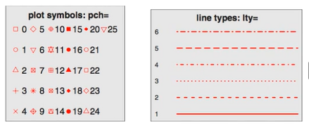
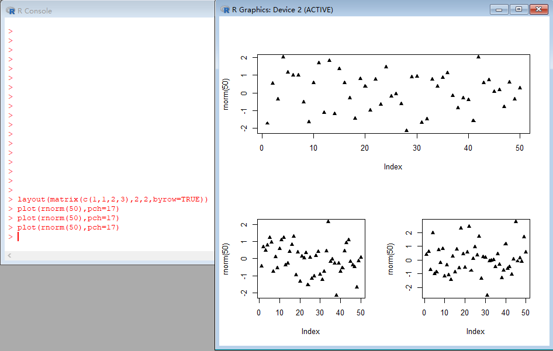
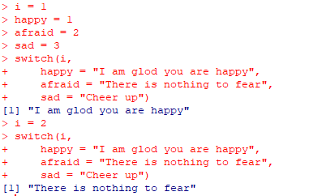

# 基础语法

[学习资料来自](https:#www.bilibili.com/video/av5625356)

> 向量(数组)

```R
# 生成一个向量
v = c(4,5,6,7,8)
# 获取第2，3，4个元素
v[c(2,3,4)] # 返回 5,6,7
v[2:4] # 同上
v[c(2,4,3)] # 返回 5 7 6
# 将第二个删掉
v[-2] # 返回 4 6 7 8
v[-2:-4] # 返回 4 8
# 查找v中值为5的内容
which(v == 5) # 返回 2 ，表示第二个
which.max(v) # 返回 5 表似乎第五个最大
which.min(v) # 返回 1
```

- 随机数

```R
set.seed(123) # 可以保证在每个电脑生成一样的随机数
a = runif(3,min=0,max=100)
 # 第二次就不能了，除非再用一次 ser.seed
a = runif(3,min=0,max=100)
runif 是平均分布随机数
rnorm 正态分布
rexp 指数分布
rbinom 二项分布
rgeom 几何分布
rnbinom 负二项分布
```

- 取整

```R
# 去掉销售部分
floor(5.6) # 返回 5
# 直接进一
celling(5.2) # 返回 6
# 取几位小数
round(5.123456,4)
```

- 读取数据

```R
# 仅仅以行分开
read.csv(file = "/xxx/a.txt")
# 这个会将两列数据分开
read.table(file = "/xxx/a.txt")
read.csv("http:#xxxxxx/csv")
# 将读取的内容变成变量
attach(data) # 直接列名就是变量了
# 上面等同于 data$列名
```

- 数据结构

```R
# 向量
a = c(1,2,3)
a = c("a","b","c")

# 矩阵
# 定义一个 5x4 的矩阵，由1~20按行填充
a = matrix(1:20, nrow=5, ncol=4, byrow=TRUE)
#  1  2  3  4
#  5  6  7  8
#  9 10 11 12
# 13 14 15 16
# 17 18 19 20
# byrow = False
a = matrix(1:20, nrow=5, ncol=4, byrow=False)
#  1  6 11 16
#  2  7 12 17
#  3  8 13 18
#  4  9 14 19
#  5 10 15 20
# 获取第二行的数据
a[2,]
# 获取第二列的数据
a[,2]
# 获取某一个特定位置
a[1,4]
# 某一个位置某一部分数据
a[1,c(1,2)]
# 可以给矩阵的行和列附上名字
rownames(a) = c("第一行","第二行","第三行","第四行","第五行")
colnames(a) = c("第一列","第二列","第三列","第四列")
```

- 数组
```R
array(data=数据,dim=维度设定,dimnames=[各个维度的名字])
dim1 = c("A1","A2")
dim2 = c("B1","B2","B3")
dim3 = c("C1","C2","C3","C4")
dim4 = c("D1","D2","D3")
array(1:72,c(2,3,4,3),dimnames=list(dim1,dim2,dim3,dim4))
```

- Data Frame
```R
id = c(1,2,3,4)
age = c(25,26,28,24)
status = c("G","G","N","N")
df = data.frame(id,age,status)
```

- list
```R
# 可以存任意不相同类型的数据
o = list(a,b,c)
# 取第一个数据
o[[1]]
```

- 画图

```R
# 将画板分成四个部分
par(mfrow=c(2,2))
plot(rnorm(50),pch=17)
plot(rnorm(50),pch=17)
plot(rnorm(50),pch=17)
plot(rnorm(50),pch=17)
```

- plot 参数

```R
pch 是点的样式
cex 点的大小 1 是原来大小，其他是倍数大小
lty 线的类型
lwd 线的宽度 1 表示原来大小 2 表示2倍粗 0.5 表示0.5倍细
```

- title 给画板设置标题

- axis 设定坐标轴的字体颜色等等

- legend 

- layout 画布的设置布局



```
layout(matrix(c(1,1,2,3),2,2,byrow=TRUE))
# 1 1
# 2 3
plot(rnorm(50),pch=17) # 1
plot(rnorm(50),pch=17) # 2
plot(rnorm(50),pch=17) # 3
# 第一个plot占上面一行，第二三个分别是下面左右
```

- 控制流程



```R
for (i in 1:10) {
    print(i)
}
while (i <= 10) {
    print(i)
    i = i + 1
}
if (i == 1) {
    print(i);
} else {
    print(i + 1);
}
switch(i,
    happy = "I am glod you are happy",
    afraid = "There is nothing to fear",
    sad = "Cheer up")
```

- 自定义函数
```R
myFn = function(a,b,c) {
    return (a + b + c)
}
```
