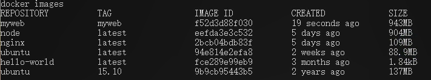
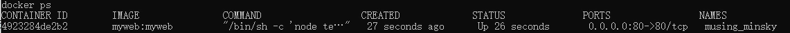
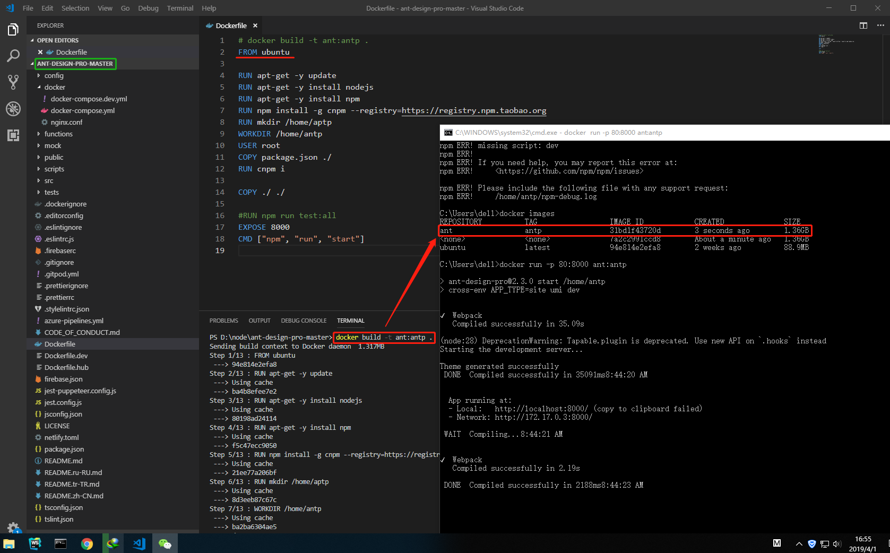

## docker 跑 Express 项目实例

> [实例视频](https://www.bilibili.com/video/av47972090/)

> [Dockerfile 官方文档](https://docs.docker.com/engine/reference/builder/)

> [docker 安装](https://github.com/IBAS0742/kaoyan/blob/master/%E5%85%BC%E9%A1%BE%E5%86%85%E5%AE%B9/docker%E5%AD%A6%E4%B9%A0/install.md)

> [我记录的文档](https://github.com/IBAS0742/kaoyan/blob/master/%E5%85%BC%E9%A1%BE%E5%86%85%E5%AE%B9/docker%E5%AD%A6%E4%B9%A0/dockerFile.md)

> [docker 命令](https://github.com/IBAS0742/kaoyan/blob/master/%E5%85%BC%E9%A1%BE%E5%86%85%E5%AE%B9/docker%E5%AD%A6%E4%B9%A0/docker%E5%91%BD%E4%BB%A4.md)

> 我的 ```express``` 网站结构如下


> 编写 ```Dockerfile``` 文件

```Dockerfile
# Dockerfile
# docker build -t myweb:myweb .
# 从 node:latest 开始构建项目
FROM node
RUN mkdir /home/web
# 复制当前文件夹下所有内容到 /home/web
COPY . /home/web
# 设置工作路径
WORKDIR /home/web
# 执行 npm install
RUN npm i
# 说明暴露端口
EXPOSE 80
# 启动点配置
ENTRYPOINT node test.js
```

> 编写 ```.dockerignore``` 文件

- 因为复制时，```node``` 项目 ```node_modules``` 一般不会进行复制，所以需要排除掉， ```COPY . /home/web``` 将复制所有文件，我们需要说明哪些不要复制

```.dockerignore
# .dockerignore
.idea/
node_modules/
document/
```

> 执行构建命令

```cmd
:: 这里配置以下他的名称和标签，默认是 <node>:<node>
:: 添加标签是为了可以更为直观知道那个镜像是哪个
docker build -t myweb:myweb .
```

> 构建前我的镜像


> 构建过程


> 构建后




> 启动

```cmd
docker run -p 80:80 myweb:myweb
:: prot 80
```

> 查看启动情况

- 可以清楚看到 COMMAND 就是 ```Dockerfile``` 文件中定义的 ```ENTRYPOINT```



> 停止 docker

```cmd
docker ps
:: CONTAINER ID        IMAGE               COMMAND                  CREATED             STATUS              PORTS                NAMES
:: 4923284de2b2        myweb:myweb         "/bin/sh -c 'node te…"   27 seconds ago      Up 26 seconds       0.0.0.0:80->80/tcp   musing_minsky
docker stop 4923284de2b2
```

> 删除 镜像

```cmd
docker images
::REPOSITORY          TAG                 IMAGE ID            CREATED             SIZE
:: myweb               myweb               f52d3d88f030        19 seconds ago      943MB
:: 因为启动过，想着为 stop ，需要加 -f 进行强制删除
docker rmi -f f52d3d88f030
```

> 为什么不使用 ```ubuntu``` 直接构建，```ubuntu``` 才 ```173MB``` 大小，我们只需要安装 ```nodejs``` ```npm```，我是这么觉得，然后实际测试了一下

> 我使用的是 ```ant-design-pro```，可以在 ```github``` 上获取该项目，该项目默认带了一个 ```Dockerfile``` 文件

```Dockerfile
FROM circleci/node:latest-browsers

WORKDIR /usr/src/app/
USER root
COPY package.json ./
RUN yarn

COPY ./ ./

RUN npm run test:all

CMD ["npm", "run", "build"]
```

> 我修改后的 ```Dockerfile``` 文件如下

```Dockerfile
# docker build -t ant:antp .
FROM ubuntu

RUN apt-get -y update
RUN apt-get -y install nodejs
RUN apt-get -y install npm
RUN npm install -g cnpm --registry=https://registry.npm.taobao.org
RUN mkdir /home/aptp
WORKDIR /home/antp
USER root
COPY package.json ./
RUN cnpm i

COPY ./ ./

#RUN npm run test:all
EXPOSE 8000
CMD ["npm", "run", "start"]
```

