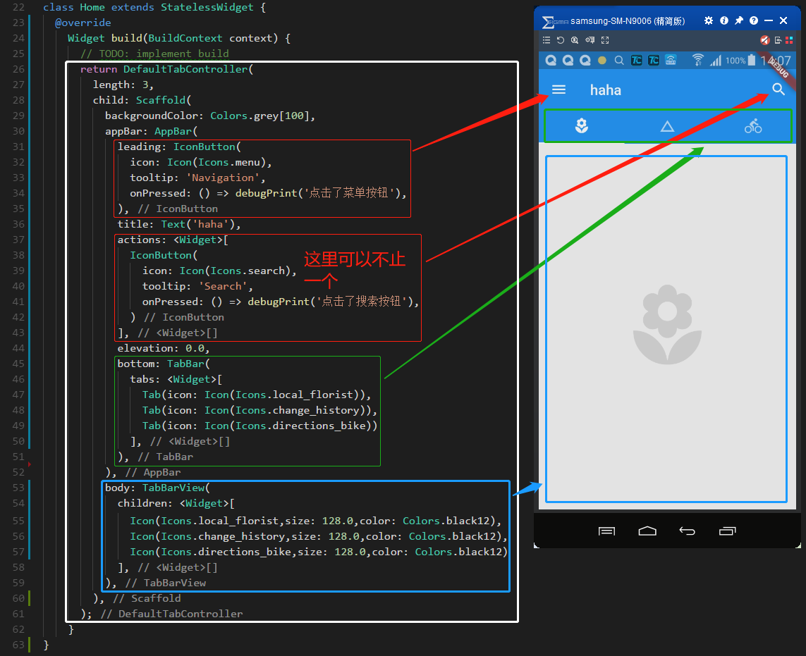
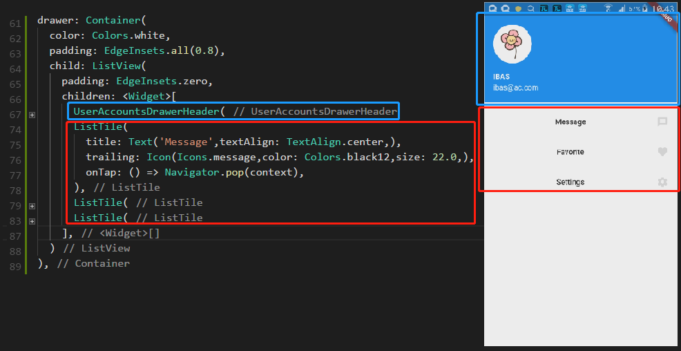

# Tab & Drawer

> tab 包含3个内容 TabBar、TabView、TabController



> 嵌套模型如下

```
TabController(
    ....
    Tarbar(
        tabs: <Widget> [ Tab ... ]
    ),
    TabBarView(
        children: <Widget> [ ... ]
    )
)
```

>> tabbar

```dart
TabBar(
    // 未选中标签颜色
    unselectedLabelColor: Colors.black38,
    // 标签下方横杆的颜色
    indicatorColor: Colors.black54,
    // 标签下方横杆的长度，默认时 tab
    indicatorSize: TabBarIndicatorSize.label,
    // 标签下方横杆的厚度
    indicatorWeight: 1.0,
    // 标签
    tabs: <Widget>[
    Tab(icon: Icon(Icons.local_florist)),
    Tab(icon: Icon(Icons.change_history)),
    Tab(icon: Icon(Icons.directions_bike))
    ],
),
```

> drawer 抽屉

- drawer 默认是从左边滑出，endDrawer 是从右边滑出

- drawer 是编写在 body 之外的


- drawer 如果作为用户信息，例子如下



-

