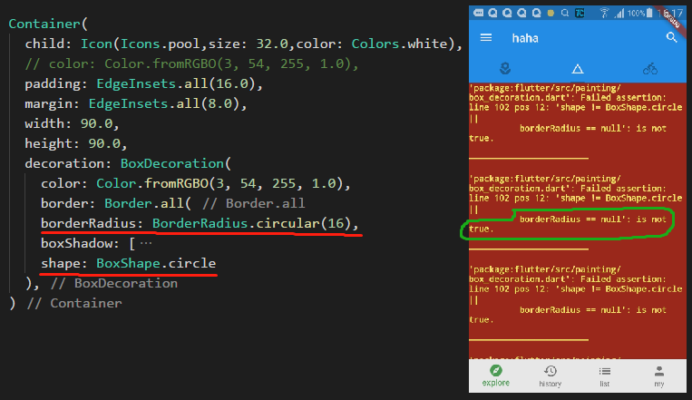
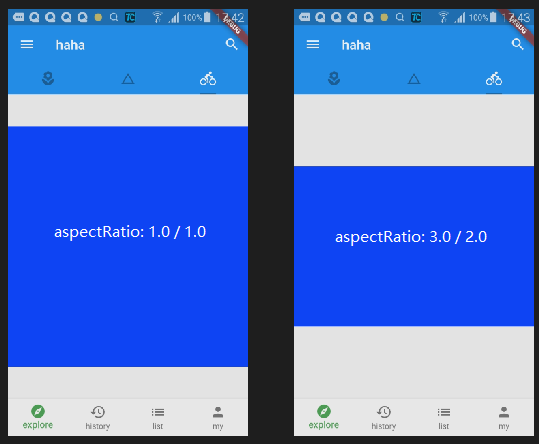
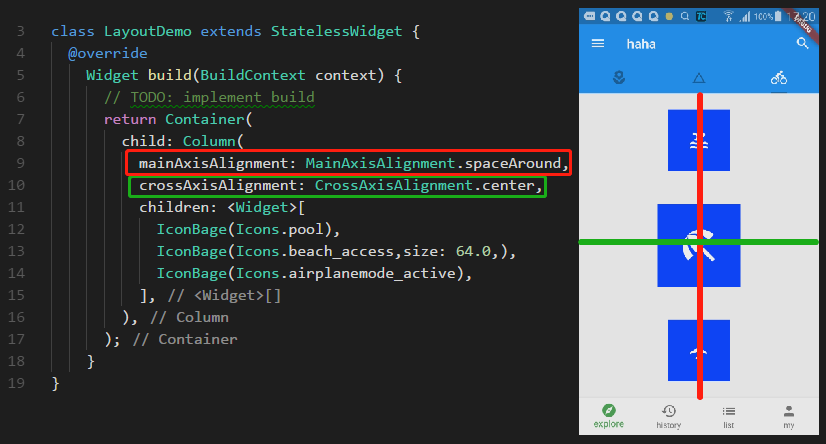
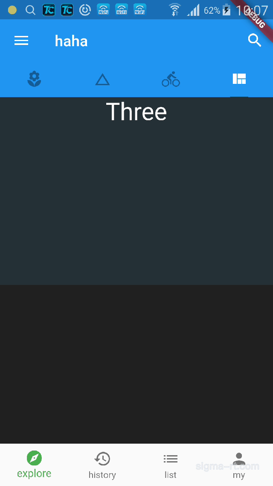
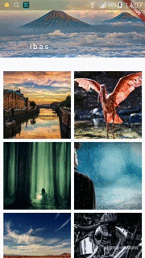

# 基础组件

> container (容器)

- 容器中多次设置颜色会报错


- 容器的边框

```dart
Container(
    child: Icon(Icons.pool,size: 32.0,color: Colors.white),
    // color: Color.fromRGBO(3, 54, 255, 1.0),
    padding: EdgeInsets.all(16.0),
    margin: EdgeInsets.all(8.0),
    width: 90.0,
    height: 90.0,
    decoration: BoxDecoration(
        color: Color.fromRGBO(3, 54, 255, 1.0),
        border: Border(
        top: BorderSide(
            color: Colors.indigoAccent[100],
            width: 3.0,
            style: BorderStyle.solid
        ),
        bottom: BorderSide(
            color: Colors.indigoAccent[100],
            width: 3.0,
            style: BorderStyle.solid
        ),
        left: BorderSide(
            color: Colors.indigoAccent[100],
            width: 3.0,
            style: BorderStyle.solid
        ),
        right: BorderSide(
            color: Colors.indigoAccent[100],
            width: 3.0,
            style: BorderStyle.solid
        ),
        )
    ),
)

// ====== 等同于下面

Container(
    child: Icon(Icons.pool,size: 32.0,color: Colors.white),
    // color: Color.fromRGBO(3, 54, 255, 1.0),
    padding: EdgeInsets.all(16.0),
    margin: EdgeInsets.all(8.0),
    width: 90.0,
    height: 90.0,
    decoration: BoxDecoration(
    color: Color.fromRGBO(3, 54, 255, 1.0),
    border: Border.all(
        color: Colors.indigoAccent[100],
        width: 3.0,
        style: BorderStyle.solid
    )
    ),
)
```

- 容器圆角(不能和容器的类型 circle 同时使用)



- 使用比例容器 AspectRatio

```dart
AspectRatio(
    aspectRatio: 1.0 / 1.0,
    child: Container(
    color: Color.fromRGBO(3, 54, 255, 1.0),
    ),
)
```



- 使用限定大小的容器

```dart
ConstrainedBox(
    constraints: BoxConstraints(
    minHeight: 200.0,
    maxWidth: 200.0
    ),
    child: Container(
    color: Colors.blueGrey,
    ),
)
```

> column & row

- column 是列排列 row 是行排列 

- mainAxisAlignment 主轴对齐方式，对于 column 是纵向的对齐方式

- crossAxisAlignment 交叉轴对齐方式，对于 column 是横向的对齐方式



> pageView 页面视图

| 参数 | 说明 |
| -- | -- |
| pageSnapping | 默认为false，表示页面滑动到中间时不自动滑到下一页 |
| reverse | 反转页面顺序 |
| scrollDirection | 默认为 Axis.horizontal 表示页面为垂直布局 |
| onPageChanged | 滑动到新页面事件 |
| controller | 页面控制参数 |

- controller 参数

| controller 参数 | 说明 |
| -- | -- |
| initialPage | 初始化时显示的页面（从 0 开始） |
| keepPage | 记住用户最后一次滑动到的位置 |
| viewportFraction | 页面的占比，默认是 1.0 即铺满 |

```dart
class ViewDemo extends StatelessWidget {
  @override
    Widget build(BuildContext context) {
      return PageView(
        pageSnapping: false,
        reverse: true,
        scrollDirection: Axis.vertical,
        onPageChanged: (currentPage) => 
            debugPrint("page" + currentPage.toString()),
        controller: PageController(
          initialPage: 1,
          keepPage: false,
          viewportFraction: 0.85
        ),
        children: <Widget>[
          Container(
            color: Colors.brown[900]
          ),
          Container(
            color: Colors.grey[900]
          ),
          Container(
            color: Colors.blueGrey[900]
          )
        ],
      );
    }
}
```

- 下面动画为 pageSnapping 为 false 的效果



> grid 网格视图

- GridView.count 参数说明

| 参数 | 说明 |
| -- | -- |
| scrollDirection | 设置滚动方向，默认是 Axis.vertical(垂直滚动) |
| crossAxisCount | 和滚动方向垂直的方向排列的项的个数 |
| crossAxisSpacing | 和滚动方向垂直的方向每个项的间隔 |
| mainAxisSpacing | 和滚动方向平行的方向每个项的间隔 |
| children | 项数组 |

```dart
Widget build(BuildContext context) {
    // TODO: implement build
    return GridView.count(
        crossAxisCount: 3,
        crossAxisSpacing: 16.0,
        mainAxisSpacing: 16.0,
        scrollDirection: Axis.horizontal,
        children: <Widget>[],
    );
}
```


- GridView.extent 参数说明和 GridView.count 的差异

| 参数 | 说明 |
| -- | -- |
| maxCrossAxisExtent | 和滚动方向垂直的方向上每个项的最大长度 |
| crossAxisCount | 该参数是 GridView.count 特有的 |

- maxCrossAxisExtent 用于限定交叉轴上项的个数

- GridView.builder 参数说明

| 参数 | 说明 |
| -- | -- |
| itemCount | 项的个数 |
| itemBuilder | 每个项的构建方法 |
| gridDelegate | 有 SliverGridDelegateWithFixedCrossAxisCount 和 SliverGridDelegateWithMaxCrossAxisExtent，里面的参数和上面的对应 |

```
GridView.builder(
    padding: EdgeInsets.all(8.0),
    itemCount: posts.length,
    itemBuilder: _gridItemBuilder,
    gridDelegate: SliverGridDelegateWithFixedCrossAxisCount(
        crossAxisCount: 3,
        crossAxisSpacing: 8.0,
        mainAxisSpacing: 8.0
    ),
);
```

- SliverGrid 滑动网格

```dart
SliverGrid(
    gridDelegate: SliverGridDelegateWithFixedCrossAxisCount(
        crossAxisCount: 2,
        crossAxisSpacing: 8.0,
        mainAxisSpacing: 8.0,
        childAspectRatio: 1.0
    ),
    delegate: SliverChildBuilderDelegate(
    (BuildContext context,int index) {
        return Container(
            child: Image.network(
                posts[index].imageUrl,
                fit: BoxFit.cover
            ),
        );
    },
    childCount: posts.length
    ),
)
```

- SliverPadding 

> - SliverGrid 是不能设置 padding 的，通过该组件可以设置

- SliverSafeArea 

> - 在苹果或者有刘海的手机中，网格内容可能会被放到刘海内看不到，添加该描述可以将部件下移。

```dart
class SliverDemo extends StatelessWidget {
  @override
    Widget build(BuildContext context) {
      // TODO: implement build
      return Scaffold(
        body: CustomScrollView(
          slivers: <Widget>[
            // 越过刘海安全区
            SliverSafeArea(
              // 为了设置 padding
              sliver: SliverPadding(
                padding: EdgeInsets.all(8.0),
                // SliverGridDemo 是 SliverGrid 中的内容
                sliver: SliverGridDemo(),
              ),
            )
          ],
        ),
      );
    }
}
```

- SliverAppBar

| 参数 | 说明 |
| -- | -- |
| title | 标题 |
| pinned | 将导航固定住 |
| floating | 上滑收起下滑展开 |
| expandedHeight | 额外扩展出的高度 |
| flexibleSpace | 扩展部分的内容 |

```dart
SliverAppBar(
    // title: Text('data'),
    // pinned: true,
    floating: true,
    expandedHeight: 178.0,
    flexibleSpace: FlexibleSpaceBar(
        title: Text(
                'IBAS'.toLowerCase(),
                textAlign: TextAlign.center,
                style: TextStyle(
                fontSize: 15.0,
                letterSpacing: 3.0,
                fontWeight: FontWeight.w400
            ),
        ),
        background: Image.network(
            'http://androidpic.sunibas.cn/landscape-3779159__340.jpg',
            fit: BoxFit.cover,
        ),
    ),
),
```




