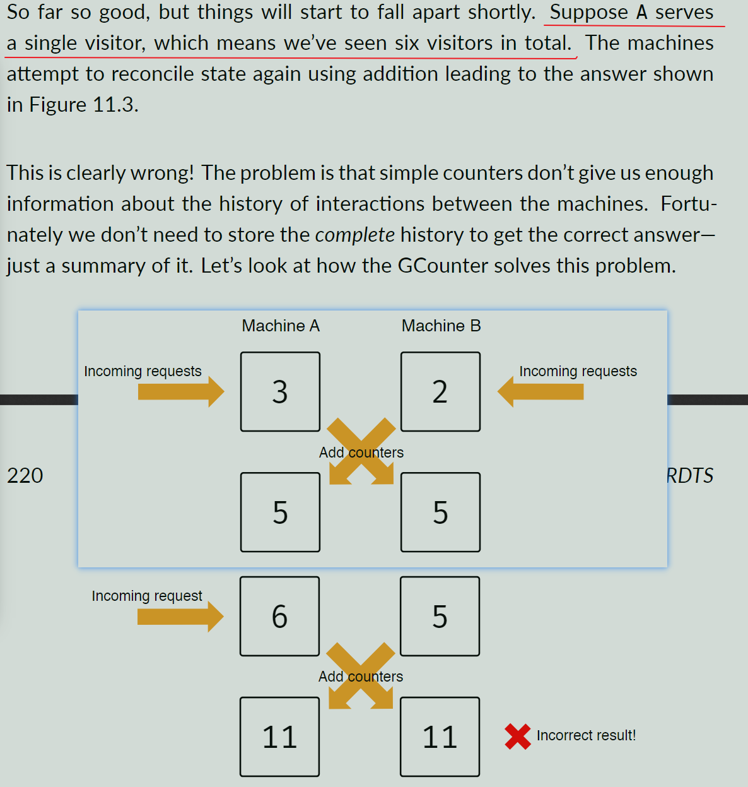
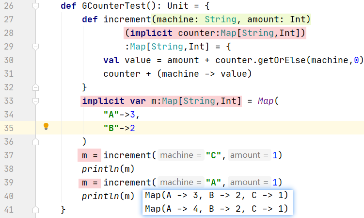
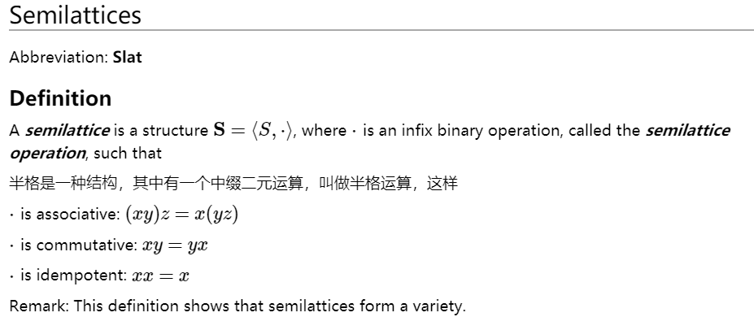
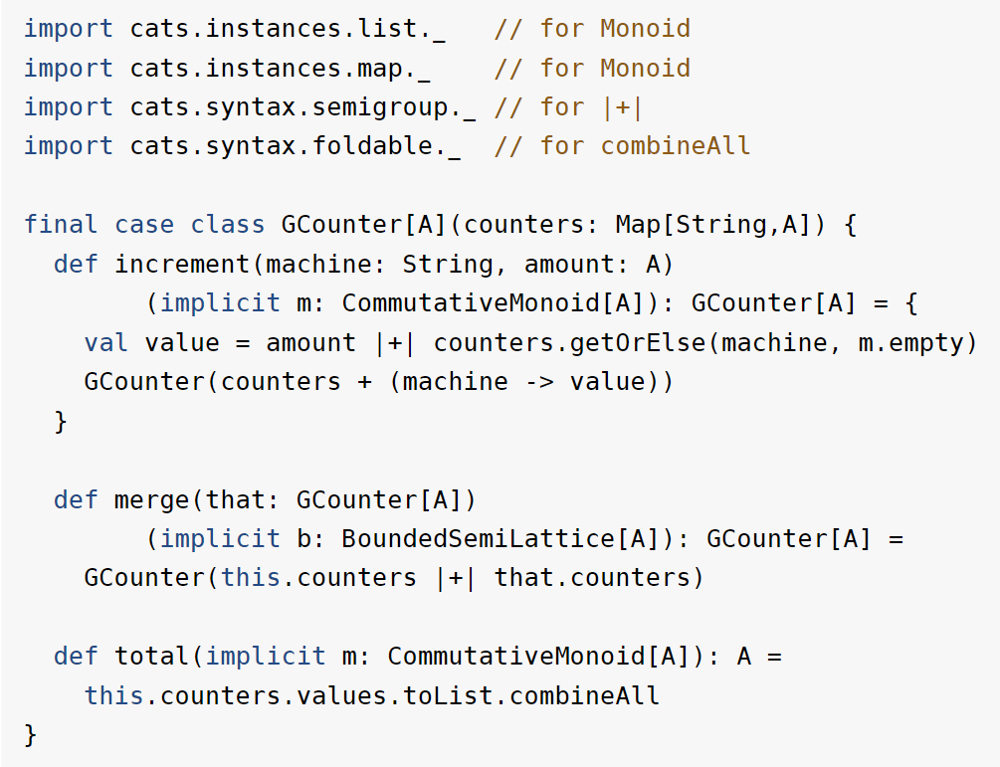

# 第11章

## case 学习 ： CRDTs

- CRDTs 直接翻译是 通讯复制数据类型，和网上的  CRDT(Conflict-Free Replicated Data Type) 不是一个内容

### 在本个案例的学习中我们将探索 Commutaࢼve Replicated Data Types (CRDTs)，这是一种数据结构能被用来协调最终一致的数据。


## 11.1 种种一致性

### 如果机器被扩展到不止一台，如何管理这些书。

- 方案一是创建相同的数据视图到每一台机器上，但是缺点是同步时会很困难，无法处理多个机器上不同的最新数据(X)

- 方案二是创建不同的数据视图到不同的机器上，问题是如何协调这些机器上的最终数据。

## 11.2 The GCounter (我们选用方案二进行)

- 这是一个分布式的增量计数器

## 11.2.1 简单的计数器

### 假设有 A B 两个服务器需要对访客数量进行计数，计数器只存储一个 Int ，并从 0 开始。

```javascript
A:0     B:0
--> 进来五个访问
A:3     B:2
--> 统计总和就是 A + B = 5
A:5     B:5     // 这里本文的意思应该是统计和被同步为当前的计数
--> 而后一个访客访问了 A
A:6     B:5     // 这时候总和被记录为了 6 + 5 = 11 显然是错误的
```



## 11.2.2 GCounters

### 让每一个机器都独立存储一个计数器，这个计数器记录了所有已知主机的访问数，他们的规则如下(假设只有 A B 两台服务器)

- 计数器只能递增自己服务器的访问数

- 当要合并各个机器的数值时，只采用最大数值

```javascript
// 开始的状态
let serverA = {A:0,B:0}
let serverB = {A:0,B:0}
// 这时候有三个访问A，两个访问B
// A+2 B+3
serverA.A += 3; // {A:3,B:0}
serverB.B += 2; // {A:0,B:2}
// 如果需要合并两个服务器的值，有
serverA.B = max(serverA.B,serverB.B); // {A:3,B:2}
serverB.A = max(serverB.A,serverA.A); // {A:3,B:2}
```

## 11.2.3 练习：GCounter Implementation

### GCounter 可以是如下代码实现

```scala
final case class GCounter(counters: Map[String, Int]) {
    def increment(machine: String, amount: Int) = {
        val value = amount + counters.getOrElse(machine,0)
        GCounter(counters + (machine -> value))
    }
    def merge(that:GCounter):GCounter = {
        GCounter(that.counters ++ this.counters.map{
            case(k,v) => 
                k -> (v max that.counters.getOrElese(k,0))
        })
    }
    def total:Int = counters.values.sum
}
```



## 11.3 概括 （Generalisation）

### GCounter 对自然是使用了以下的操作

- 加法(递增和求和)

- 求最大值

- 标识元素0 (递增和合并数值)

### 可以想到这里需要用到幺半群的一些特性，在第二章，可以看到合并操作 +

```
(a + b) + c == a + (b + c)
```

### 和标识元素 0

```
0 + a == a + 0 == a
```

### 幂等操作，同样的数据反复计算后不会影响结果

```
a max a == a
max 就是一个幂等操作
```

| 方法 | 标识(identity) | 可交换性(commutative) | 联系性(Associative)|幂等性(Idempotent)|
|:--:|:--:|:--:|:--:|:--:|
|递增(increment)|Y|N|Y|N|
|合并(merge)|Y|Y|Y|Y|
|加和(total)|Y|Y|Y|N|

### 从表格我们能看到

- 递增(increment)   需要 幺半群(monoid)

- 加和(total)       需要 可交换的幺半群(commutative monoid)

- 合并(merge)       需要 一个 幂等交换的幺半群(有界半格)



## 11.3.1 Implementation

### cats 提供了 幺半群(Monoid) 和 可交换幺半群(CommutativeMonoid) 的类型类(type class)，但是没有提供有界半格(bounded semillattice)，所以我们需要自己实现有界半格类型类

```scala
import cats.kernel.CommutativeMonid

trait BoundedSemiLattice[A] extends CommutativeMonoid[A] {
    def combine(a1:A,a2:A):A
    def empty:A
}
```

### BoundedSemiLattice[A] 继承自 CommutativeMonoid[A]，因为有界半格是一个可交换的幺半群，确切的讲是一个可交换的幂等

## 11.3.2 实现 Int 和 Set 的有界半格

```scala
object BoundedSemiLattice {
    implicit val intInstance:BoundedSemiLattice[Int] = 
        new BoundedSemiLattice[Int] {
            def combine(a1:Int,a2:Int):Int =
                a1 max a2
            def empty:Int = 0
        }
    implicit val setInstance:BoundedSemiLattice[A] = 
        new BoundedSemiLattice[Set[A]] {
            def combine(a1:Set[A],a2:Set[A]):Set[A] =
                a1 union a2
            def empty:Int = Set.empty[A]
        }
}
```

## 11.3.3  Generic GCounter



## 11.4 抽象 GCounter 为一个 类型类

### 将 GCounter 进行抽象，使得能满足更多的情况，map的key和value需要用泛型标记为两种类型，所以需要两个泛型类型

```scala
trait GCounter[F[_,_],K,V] {
    def increment(f: F[K,V])(k: K,v: V)
        (implicit m:CommutativeMonoid[V]):F[K,V]

    def merge(f1: F[K,V],f2: F[K,V])
        (implicit m:BoundedSemiLattice[V]):F[K,V]

    def total(f: F[K,V])
        (implicit m:CommutativeMonoid[V]): V
}

object GCounter {
    def apply[F[_,_],K,V]
            (implicit counter:GCounter[F,K,V]) =
        counter
}
// 下面是一个完整的实例
import cats.instances.list._    // for Monoid
import cats.instances.map._     // for Monoid
import cats.syntax.semigroup._  // for |+|
import cats.syntax.foldable._   // for combineAll

implicit def mapInstance[K,V]:GCounter[Map,K,V] =
    new GCounter[Map,K,V] {
        def increment(map: Map[K, V])(key: K,value: V)m
            (implicit m: CommutativeMonoid[V]): Map[K,V] = {
                val total = map.getOrElse(key, m.empty) |+| value
                map + (key -> total)
            }
        
        def merge(map1:Map[K, V],map2: Map[K,V])
            (implicit b: BoundedSemiLattice[V]): Map[K,V] =
            map1 |+| map2
        
        def total(map: Map[K,V])
            (implicit m: CommutativeMonoid[V]): V =
            map.values.toList.combineAll
    }
```

### 完整的可运行代码在这里[获取](https://gitee.com/IBAS0742/shareCode/blob/master/bigData/GCounter.scala)

## 11.5 抽象键值存取

### 上面的抽象方案看起来依旧不是很满意，大部分内容无法复用，这里我们将重心转移到键值的存取上，抽象代码如下

```scala
trait KeyValueStore[F[_,_]] {
    def put[K,V](f: F[K,V])(k: K,v: V): F[K,V]

    def get[K,V](f: F[K,V])(k: K): Option[V]

    def getOrElse[K,V](f: F[K,V])(k: K, default: V): V =
        get(f)(k).getOrElse(default)

    def values[K,V](f: F[K,V]): List[V]
}
// 实现对应的 map 实例
implicit val mapInstance: KeyValueStore[Map] = 
    new KeyValueStore[Map] {
        def put[K,V](f: Map[K,v])(K: k,v: V): Map[K,V]
            = f + (k -> v)

        def get[K,V](f: Map[K,V])(k: K):Option[V] =
            f.get(k)
        
        override def getOrElse[K,V](f: Map[K,V])
            (k: K,default: V):V = 
            f.getOrElse(k,default)

        def values[K,V](f:Map[K,V]): List[V] =
            f.values.toList
    }
```

### 编写完上面这个接口后，我们可以定义其隐式类

```scala
implicit class KvsOps[F[_,_],K,V](f: F[K,V]) {...}
// 然后替换 gcounterInstance 中的 键值方法
```

## 11.6 总结

### 本章了解如何使用类型类在 scala 中进行 简单的 CRDT 建模（即实现 GCounter的过程）