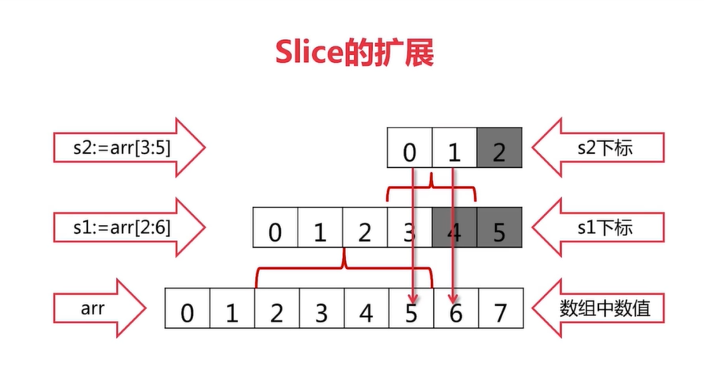
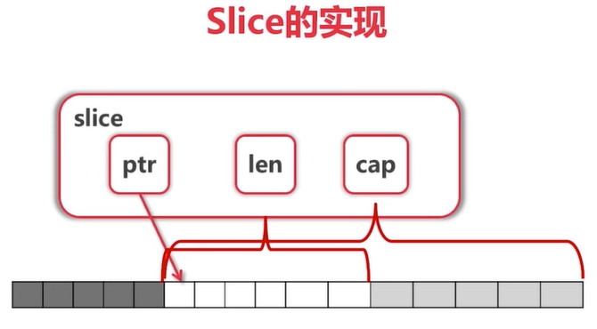

# 数组

- 数组是值类型，函数调用时会拷贝一份，修改无效

```go
var arr [5]int
var arr [5][6]int
arr := [3]int{1,2,3}
arr := [...]int{1,2,3,4,5,6}

for i:=0; i < len(arr);i++ {
    arr[i]
}

for i,v := range arr {
    arr[i]  // 通过所以取
    v       // 值
}
for _,v := range arr {
    v   // 只要值
}

```

```go
// 定义函数的正确做法
// 这里的 [4]int 4 不应该去掉
func f(arr [4]int) int {
    return arr[0];
}
```

# 切片

- 切片修改会修改原数组

- 可以向后扩展，但是不能向前扩展





```go
arr := [...]int{0,1,2,3,4,5,6,7}
s := arr[2:6]

// 函数定义
// 注意这里是 []，所以这里指的是切片
func f(arr []int) {}

// 下面是调用
f(arr)  // arr 不是切片是数组
f(s)    // s 是切片，调用正确

// 切片可以扩展
arr := [...]int{0,1,2,3,4,5,6,7}
s := arr[2:6]
s = s[4:6]
fmt.Println("%d\t%d",len(s),cap(s))

// 切片可以扩展
arr := [...]int{1,2}
s := arr[:]
s1 := append(s,3)   // s1 = [1,2,3]
fmt.Println(arr)    // arr = [1,2]
// 这时候 s1 已经不是 arr 的切片，由系统自动分配
```

- 定义切片

```go
var s []int
for i := 0;i < 100;i++ {
    s = append(s, 2 * i + 1)
}

s1 := []int{2,4,6}

// make(类型，len，cap)
s2 := make([]int, 10 , 12)

// copy(切片，到切片)
// 
```
