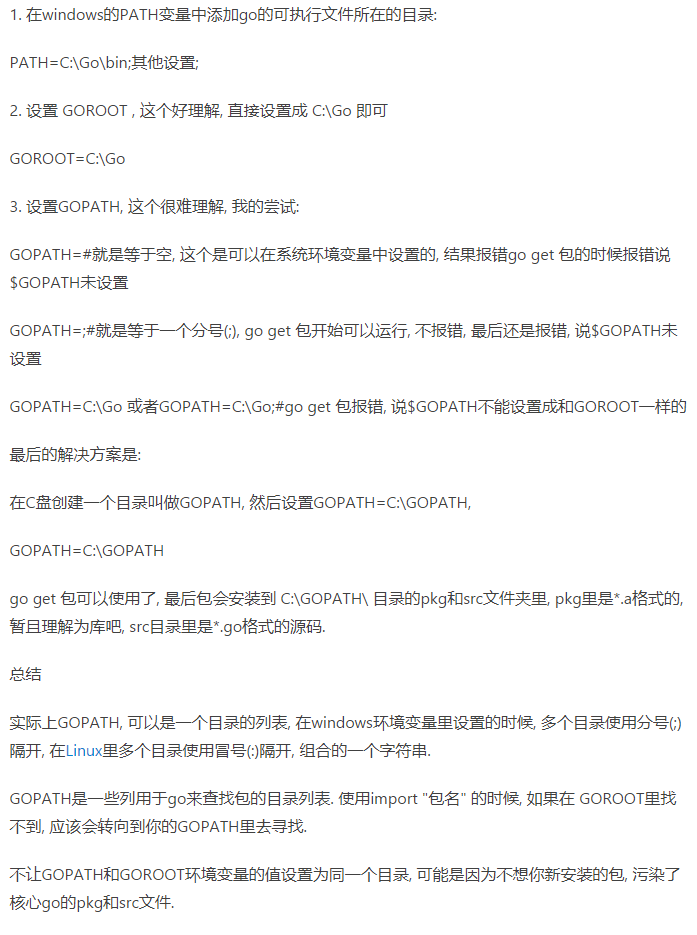

# gopath & goroot



```
:: GOPATH 这个是我自己建的
GOPATH=C:\GO\GOPATH
GOROOT=C:\GO
path=%path%;%GOROOT%\bin;%GOPATH%\bin
```

# 安装其他包

- go get 包 // 一般下载不了，因为下载位置在谷歌

- 可以使用 gopm（个人发现 gopm 没办法正常使用）

```cmd
:: 安装gopm
go get -v github.com/gpmgo/gopm
go install github.com/gpmgo/gopm
```

- 使用代理[goproxy.io] [goproxy.cn] [https://mirrors.aliyun.com/goproxy/]

```cmd
:: 使用上面三个代理都可以实现
:: 在命令行窗口中(这里指windows)
go env -w GO111MODULE="on"
go env -w GOPROXY=https://goproxy.cn,direct
:: 尝试下载一个插件
:: 这个命令带v后不会下载到src目录下
go get -v golang.org/x/tools/cmd/goimports
:: 这个语句才能将包下载到 src 目录下
go get golang.org/x/tools/cmd/goimports
```