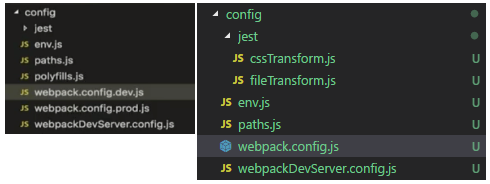

## less 配置

- 需要安装 less、less-loader 两个插件

```shell
yarn add less,less-loader
```

> 下面左图是网上普通教程的config内容，右图是我当前的config内容，配置内容也不一样



[less配置参考](https://www.jianshu.com/p/dbc8e0e80de5)

- 右图配置 less 如下，打开 webpack.config.js 文件

```js
const lessRegex = /\.less$/;
const lessModuleRegex = /\.module\.less$/;
// less 配置(放在 sass 后面即可)
{
    test: lessRegex,
    exclude: lessModuleRegex,
    use: getStyleLoaders({ importLoaders: 2 }, 'less-loader'),
},
{
    test: lessModuleRegex,
    use: getStyleLoaders(
        {
            importLoaders: 2,
            modules: true,
            getLocalIdent: getCSSModuleLocalIdent,
        },
        'less-loader'
    ),
},
```

- 左图配置如下，打开 webpack.config.dev.js 和 webpack.config.prod.js 文件

[less 配置参考](https://www.cnblogs.com/esofar/p/9631657.html)

> 理论上讲，需要同步修改 webpack.config.dev.js 和 webpack.config.prod.js 配置文件：

> 在module.rules节点中找到 css 文件的加载规则：

> * test: /\.css$/ 修改为 test: /\.(css|less)$/；

> * 在use数组最后新增一个对象元素{loader: require.resolve('less-loader')}。

```js
{
  test: /\.(css|less)$/,
  use: [
    require.resolve('style-loader'),
    {
      loader: require.resolve('css-loader'),
      options: {
        importLoaders: 1,
      },
    },
    {
      loader: require.resolve('postcss-loader'),
      options: {
        // Necessary for external CSS imports to work
        // https://github.com/facebookincubator/create-react-app/issues/2677
        ident: 'postcss',
        plugins: () => [
          require('postcss-flexbugs-fixes'),
          autoprefixer({
            browsers: [
              '>1%',
              'last 4 versions',
              'Firefox ESR',
              'not ie < 9', // React doesn't support IE8 anyway
            ],
            flexbox: 'no-2009',
          }),
        ],
      },
    },
    {
      loader: require.resolve('less-loader')
    }
  ],
},
```