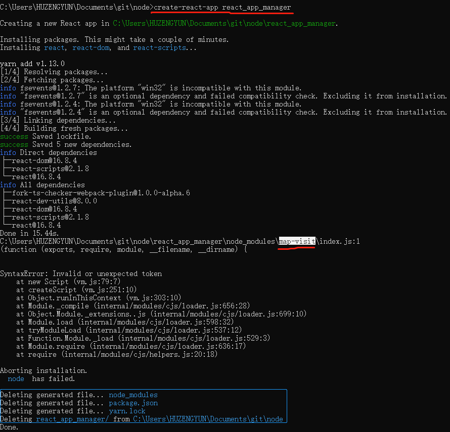
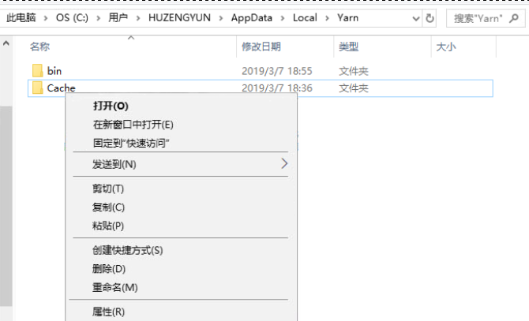

### 初次接触 create-react-app 遇到的问题


```cmd
:: 初次遇到实在不知道是什么情况
:: 思考很久之后决定将跟他相关的可疑内容全部删掉

:: 然后有了第二个错误
```



```cmd
:: 然后我继续，发现下一个是 get-value\index.js:1
:: 然后我就失望了，我觉得这个应该是一个cache的问题
:: 我决定删除他们的源
:: 于是我删除了
```

