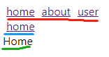

## React 插件

> 1. 路由(react-router-dom)

- [参考网站](https://reacttraining.com/react-router/web/guides/quick-start)

- 安装 react-router-dom 将包含 react-router

```cmd
yarn add react-router-dom
:: no react-router
```

```javascript
import { BrowserRouter, Route, Link } from 'react-router-dom';
import React from 'react';

export default class TestRouter extends React.Component {
    render() {
        return <BrowserRouter>
            <div>
                <Link to="/home">home</Link>
                <Link to="/about">about</Link>
                <Link to="/user">user</Link>
                
                <Route path='/home' component={Home}></Route>
                <Route path='/about' component={About}></Route>
                <Route path='/user' render={() => <User>
                    <div>
                        <Link to="/user/home">home</Link>
                        <Route path='/user/home' component={Home}></Route>
                    </div>
                </User>}></Route>
            </div>
        </BrowserRouter>
    }
}

class Home  extends React.Component {
    render() {
        return <div>Home</div>
    }
}

class About  extends React.Component {
    render() {
        return <div>About</div>
    }
}

class User  extends React.Component {
    render() {
        return <div>
            {this.props.children}
        </div>
    }
}
```



- 说明

   - BrowserRouter 只能有一个根节点

   - Link 相当于是 a 标签

   - Route 内部可以有 exact 表示匹配需要全匹配到，例如 /about 可以匹配到 / 和 /about 两个路由

   - Route component 可以使用 render 来实现子路由

   - 可以使用一个文件来管理整个 router ，然后通过各处的 link 来导航路由

> 2. Redux 

- [参考网站](https://www.redux.org.cn/)

- [学习网站](https://www.redux.org.cn/)

- 安装 redux react-redux (redux-devtools 用于调试)

```cmd
yarn add redux react-redux
:: 用于调试
yarn add redux-devtools
```
