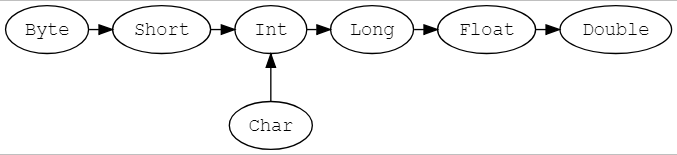

# 统一类型


[图片来源](https://docs.scala-lang.org/resources/images/tour/unified-types-diagram.svg)

> ```Any``` 为所有类型的超类，其中包含两个子类 ```AnyVal``` ```AnyRef```

- ```Any``` 包含通用方法 ```equals``` ```hashCode``` ```toString```

> ```AnyVal``` 所有值类型的父类

- 包含以下内容 ```Double``` ```Float``` ```Long``` ```Int``` ```Short``` ```Byte``` ```Char``` ```Unit``` ```Boolean```

> ```AnyRef``` 所有引用类型的父类

> 类型转换



```scalc
val x: Long = 987654321
val y: Float = x  // 9.8765434E8 (note that some precision is lost in this case)

val face: Char = '☺'
val number: Int = face  // 9786

// 转化是单向的，如果反过来会编译错误
val x: Long = 987654321
val y: Float = x  // 9.8765434E8
val z: Long = y  // Does not conform
```

- 以下为官方内容

## Nothing和Null

Nothing是所有类型的子类型，也称为底部类型。没有一个值是Nothing类型的。它的用途之一是给出非正常终止的信号，如抛出异常、程序退出或者一个无限循环（可以理解为它是一个不对值进行定义的表达式的类型，或者是一个不能正常返回的方法）。

Null是所有引用类型的子类型（即AnyRef的任意子类型）。它有一个单例值由关键字null所定义。Null主要是使得Scala满足和其他JVM语言的互操作性，但是几乎不应该在Scala代码中使用。我们将在后面的章节中介绍null的替代方案。