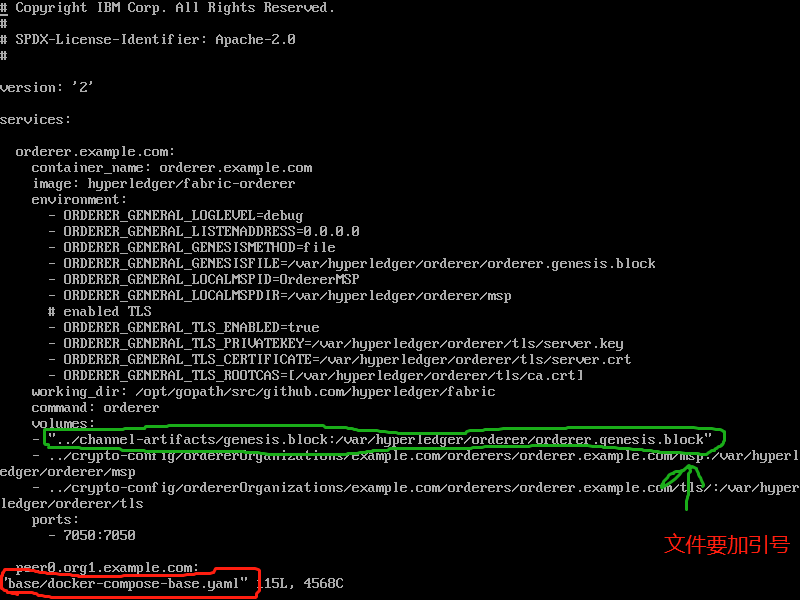
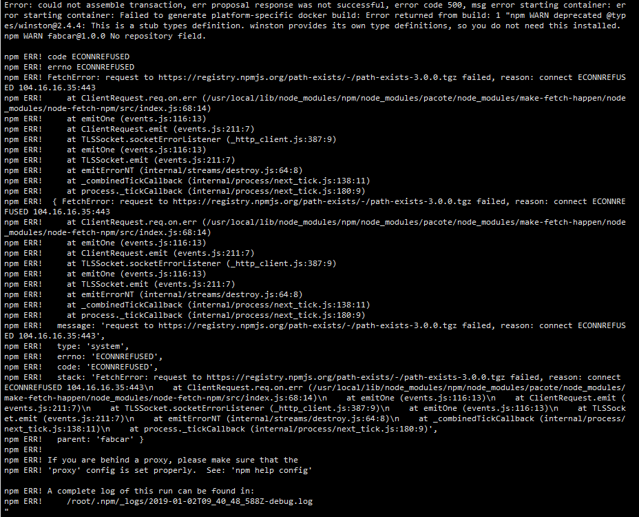
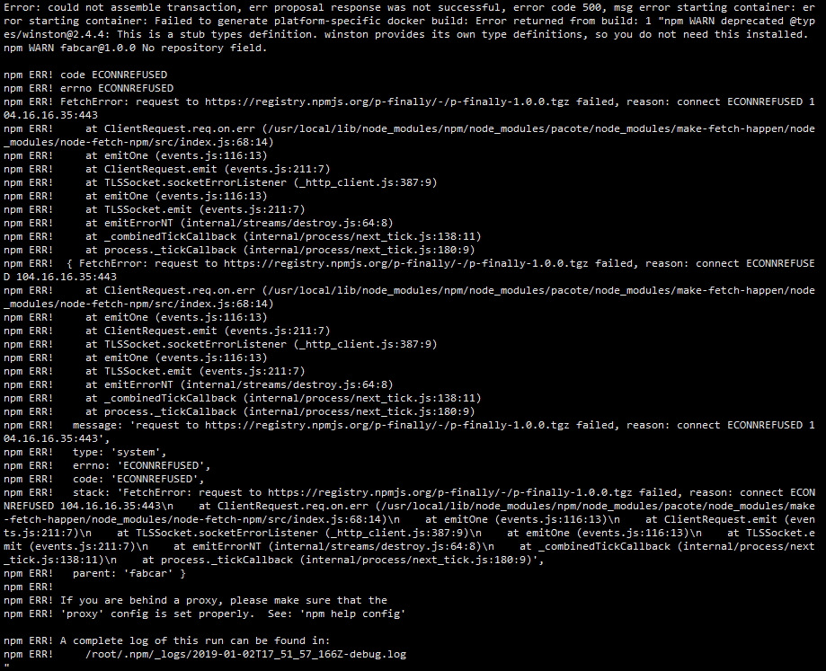

## 下面第一部分，参照博文搭建是遇到的问题找不到解决方案，后面重新参照官方文档进行，请看第二部分

> ## PART ONE
 
### 第一个问题

#### 重现

```bash
2018-12-28 17:41:15.499 UTC [msp] GetLocalMSP -> DEBU 001 Returning existing local MSP
2018-12-28 17:41:15.500 UTC [msp] GetDefaultSigningIdentity -> DEBU 002 Obtaining default signing identity
2018-12-28 17:41:17.707 UTC [grpc] Printf -> DEBU 003 grpc: addrConn.resetTransport failed to create client transport: connection error: esc = "transport: Error while dialing dial tcp: lookup orderer.example.com on 127.0.0.11:53: no such host"; Reconnecting to {orderer.examle.com:7050 <nil>}
Error: Error connecting due to  rpc error: code = Unavailable desc = grpc: the connection is unavailable
Usage:
  peer channel create [flags]

Flags:
  -c, --channelID string   In case of a newChain command, the channel ID to create.
  -f, --file string        Configuration transaction file generated by a tool such as configtxgen for submitting to orderer
  -t, --timeout int        Channel creation timeout (default 5)

Global Flags:
      --cafile string              Path to file containing PEM-encoded trusted certificate(s) for the ordering endpoint
      --logging-level string       Default logging level and overrides, see core.yaml for full syntax
  -o, --orderer string             Ordering service endpoint
      --test.coverprofile string   Done (default "coverage.cov")
      --tls                        Use TLS when communicating with the orderer endpoint
  -v, --version                    Display current version of fabric peer server

!!!!!!!!!!!!!!! Channel creation failed !!!!!!!!!!!!!!!!
================== ERROR !!! FAILED to execute End-2-End Scenario ==================
```


#### 解决方案

> https://juejin.im/entry/5b7ba10e6fb9a01a12502314



---

> ## 以上问题，是参照一个博文搭建时遇到的，下面问题是参照官方文档搭建时遇到的

> ## PART TWO

>> #### 第一个问题(同时注意 node 和 npm 版本的官方要求)


>> ### 解决方案是，安装 g++，添加 --unsafe-perm

```
yum install gcc-c++
cnpm install --unsafe-perm
```


>> ## 第二个问题




>> ### 这个问题，解决方案是将镜像地址修改为 淘宝镜像

```bash
npm config set registry https://registry.npm.taobao.org
# 检查源地址
npm config get registry
```


>> - 这个截图是因为我前面没有截取报错信息，临时在网上找的相似的错误信息

>> ### 这个问题，我的解决方案是提前安装 x509@0.3.3

```bash
npm i -g x509@0.3.3 --unsafe-perm
```



>> - 如果避开了上面所有问题还是不行，提议做法如下

```bash
# 1. 重启虚拟机

# 2. 进入到 /home/ibas/fabric-samples-1.4.0-rc2/first-network
cd /home/ibas/fabric-samples-1.4.0-rc2/first-network
./byfn.sh down
docker rm -f $(docker ps -aq)
docker rmi -f $(docker images | grep fabcar | awk '{print $3}')

# 回到 fabcar
cd ../fabcar
rm -Rf javascript/node_modules
./startFabric.sh javascript

# 可以开启另一个终端窗口(查看 docker 日志)
docker logs -f peer0.org1.example.com

# 一直等到执行结束


```