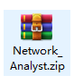
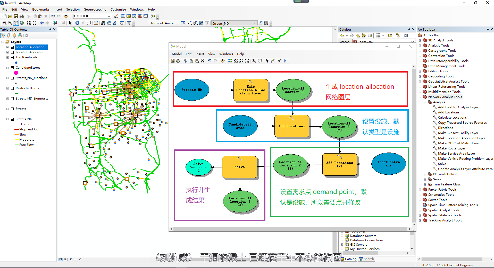
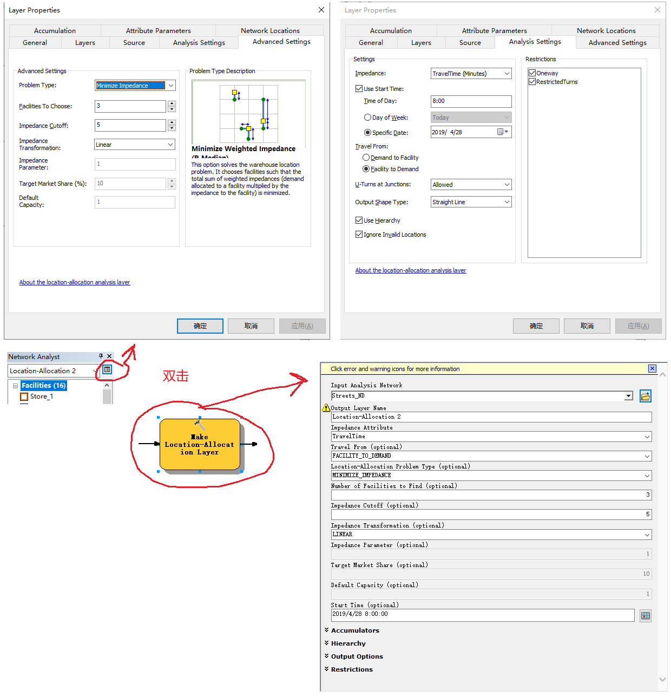

# network analysis

## [网络分析练习](http://www.arcgis.com/home/item.html?id=d6bd91b2fddc483b8ccbc66942db84cb)

### 1.location allocation

[参考网站](http://desktop.arcgis.com/en/arcmap/latest/extensions/network-analyst/exercise-9-choosing-optimal-store-sites-using-location-allocation.htm)

> 下载数据



> 开始

> 结果



> 中间过程说明

- 两个过程的设置方法分别如下

- 1.设置设施使用的量和在路径选择上的阻抗，这里设置```Facilities To Choose=3``` 表示使用3个设施，```Impedance Cutoff=5```表示从需求点到设施需要在5分钟内能到达

- 2.设置路线规划的时间，图中未 ```8:00``` ，在各个时间点存在不同的交通情况，例如早高峰和中午同一条路的```通过时间```是不同的

- 3.设置需求点(```Demand Points```)时，设置了加权 ```Weight=POP2000```，表示使用 2000 年的人口普查结果作为加权



