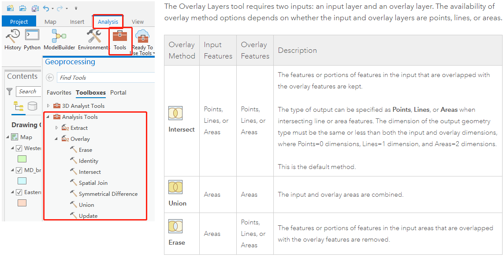
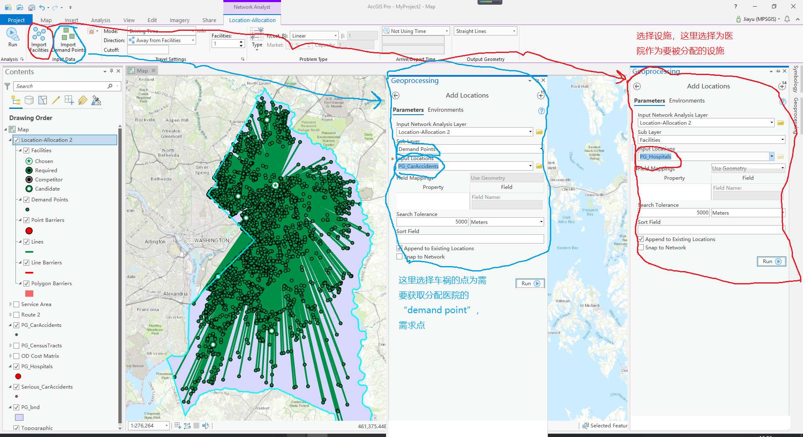

## 概念

[arcgis-online 文档](http://doc.arcgis.com/en/arcgis-online/analyze/dissolve-boundaries.htm)



> ```ZONE``` 和 ```REGION```

- ```ZONE``` 是值相同的区域的集合

- ```REGION``` 是相互隔开的区域

> ```Merge``` 会将相同的区域合并为一个，在地图上显示为一个，但根据属性表中可以发现重复的区域

> 区域资源分配(location allocation)

- 这里要先选定分配的资源是哪些

- 然后哪些事务需要去分享这些资源

