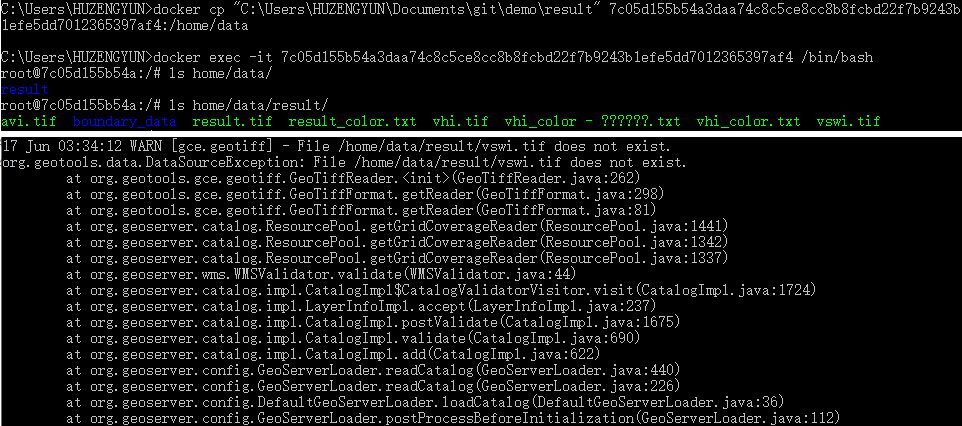

# commit

- 命令

```bash
docker commit 7c05d155b54a geoserver-tmp
%% sha256:b62caa56651f59da64e2264d066fb4d7a2340a3b62d111321e8ce1c16f8031eb
```

- 注意 *commit 前必须停止容器 docker stop id*



- 注意：使用 ```docker cp``` 命令复制到 docker 中的文件无法保存，建议使用 挂载启动 ```docker run -v "":/home/data``` 形式