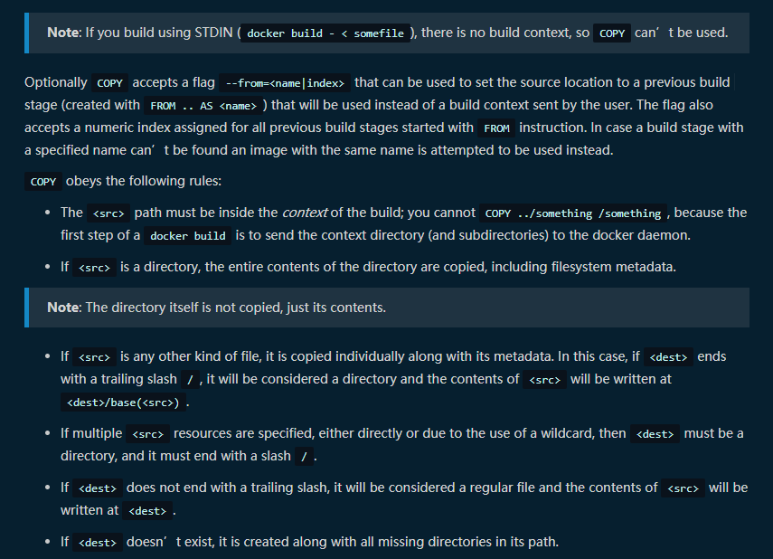

# [Dockerfile](https://docs.docker.com/engine/reference/builder/) 如何编写

## 1. 使用 dockerfile 

```bash
# 在 dockerfile 文件夹目录下执行以下命令
# 即可构建需要的 docker 环境
docker build .
```

> Warning: Do not use your root directory, /, as the PATH as it causes the build to transfer the entire contents of your hard drive to the Docker daemon.

> 官方提醒：如果需要使用路径，请不用使用 ```/``` 作为路径的开头，这样构建会将整个主机的内容复制到docker中

- 需要指定 docker 文件位置时，需要使用 ```-f```

```bash
# dockerfile 文件位于 /path/to/a/docker/file 目录中时
docker build -f /path/to/a/docker/file .
```

- 需要指定构建后的镜像标记时，使用 ```-t```

```bash
docker build -f /docker/file/path -t my/app:tag .
```

> 说明：

>> 1. dockerfile 执行前会先检查语法

>> 2. dockerfile 执行时会逐行进行，并在执行完每一行做一次提交

>> 3. 任何情况下，如果有可用的构建历史过程，该过程将使用历史记录，而不是重新构建，以加快构建速度 ```--cache-from``` 可以用来指定获取的历史构建

## 2. dockerfile 语法

> 默认解析器不关注大小写

> 命令可以只用 ```\``` 进行换行

### 1. 注释 Comment

```dockerfile
# 注释内容
```

> 注释不支持换行

### 2. 额外支持的解析器

**```syntax```** **```escape```**

- [syntax](https://docs.docker.com/engine/reference/builder/#syntax) 使用远程的镜像配置

> 可用于统一用户配置，在需要统一更新发布版本的```dockerfile```配置时（虽然我不知道是否理解错误，也不知道使用场景）

```dockerfile
# syntax docker/docker-file
# syntax example.com/docker-file
```

- [escape](https://docs.docker.com/engine/reference/builder/#escape)

> 用于指定转义字符，默认为 \

```dockerfile
FROM microsoft/nanoserver
COPY testfile.txt c:\\path\\
```

> 如果修改转义字符

```dockerfile
# escape=`
FROM microsoft/nanoserver
COPY testfile.txt c:\path\
```

### 3. 环境变量

> 注意 1.4 版本之前的 docker 不支持该语法点内容

1. 定义环境变量 ```env``` ```变量名``` ```值```

```dockerfile
env foo value
```

2. 获取变量值，使用 ```$变量名``` 或者 ```${变量名}``` 均可，使用后者可以有更为神奇的操作

```dockerfile
env foo value
workdir ${foo}
workdir $foo
# 需要紧跟字符串时，可以使用 ${}
workdir ${foo}Name
```

3. 简单运算

```dockerfile
env foo value
# foo 当前已经定义值为 value，下面语句等同为
# workdir value
workdir ${foo:-ibas}

# haha 未定义，以下语句等同为
# workdir ibas
workdir ${haha:-ibas}

# foo 以定义，以下等同
# workdir ibas
workdir ${foo:+ibas}

# haha 未定义，以下语句等同为【空字符串】
# workdir
workdir ${haha:+ibas}
```

4. 以上三点说明在以下```命令```中有效 

```dockerfile
ADD
COPY
ENV
EXPOSE
FROM
LABEL
STOPSIGNAL
USER
VOLUME
WORKDIR
```

5. 变量定义为逐行进行，当前行的变量值为上一行的值，不管是否发生变化，例如

```dockerfile
env a=name
# 当前 a 是 name ，不管是否前面已经定义 a=ibas，在 b=$a 时，a 依旧取 name
env a=ibas b=$a
# 上一行已经修改了 a 的内容为 ibas
env c=$a
# 到此处
# a=ibas
# b=name
# c=ibas
```

### 4. .dockerignore 文件

> 在执行复制或者添加文件时，有时候需要忽略某些文件，这里使用 .dockerignore 

```dockerignore
# 注释

# 排除所有存在任意级目录的 temp* 结尾的文件 
# 例如
# /a/temp
# /a/b/temporary.txt
*/temp*

# 排除所有 二级目录的
*/*/temp*

# 排除所有的 temp 开头并后面跟随一个字符的文件或文件夹
# 例如
# /temp1
# /temp2/
temp?

#反向选择
# 排除了所有的 md 文件，但是保留 README.md 被包含
*.md
!README.md

# 但是
# 最后一行匹配是依旧进行排除
# 第二行排除了 README*.md 
# 第三行反向包含了 README-secret.md
*.md
!README*.md
README-secret.md
```

### 5. <a id="form">FROM</a>

> 用于获取镜像，每次```from```会获取一个新的镜像，并且清除前面的设定，所以每次```from```前需要提交当前状态

> ```from``` 获取镜像后，后面的语句是对镜像的操作，所以 ```from``` 前面只能是 ```arg``` 命令

> ```as name``` 可以在后面的镜像状态复制时使用

```dockerfile
FROM <image> [AS <name>]

FROM <image>[:<tag>] [AS <name>]

FROM <image>[@<digest>] [AS <name>]
```

- ```arg``` 是唯一一个可以放置到 ```from``` 前面的修饰符

> ```arg``` 是用来定义或获取变量

>> dockerfile 定义如下时

```dockerfile
arg user=ibas
arg systype=ubuntu
arg tag=latest
from $user/$systype:$tag
```

>> 构建命令可以如下

```bash
docker build . -build-arg user=bing
# 如果没有设置则使用默认参数
```

### 6. RUN

> 每一次 ```RUN``` 之后会提交一个修改记录

```dockerfile
# 有两种形式

# 直接在镜像内执行 shell 命令
RUN <command>
RUN /bin/bash -c 'source $HOME/.bashrc; \
    echo $HOME'

# 执行可执行文件，并赋予参数
RUN ["executable", "param1", "param2"]
RUN ["/bin/bash", "-c", "echo hello"]
```

### 7. CMD

> 1. cmd 指令只能有一个，如果有多行，只认最后一行

> 2. cmd 定义的指令，如果是 ```#3``` ，那么命令会在 ```docker run image /bash/sh -c``` 时被调用

> 3. ```#1``` 需要使用 **双引号**

```dockerfile
# 1
CMD ["executable","param1","param2"] (exec form, this is the preferred form)

# 2
CMD ["param1","param2"] (as default parameters to ENTRYPOINT)

# 3
CMD command param1 param2 (shell form)
```

> 区别 ```RUN``` 和 ```CMD``` 是不同的使用情景。

### 8. LABEL

> 用于给一个镜像的附加信息

```dockerfile
LABEL "com.example.vendor"="ACME Incorporated"
LABEL com.example.label-with-value="foo"
LABEL version="1.0"
LABEL description="This text illustrates \
that label-values can span multiple lines."
LABEL multi.label1="value1" \
      multi.label2="value2" \
      other="value3"
```

```JSON
{
    "Labels": {
        "com.example.vendor": "ACME Incorporated"
        "com.example.label-with-value": "foo",
        "version": "1.0",
        "description": "This text illustrates that label-values can span multiple lines.",
        "multi.label1": "value1",
        "multi.label2": "value2",
        "other": "value3"
    }
}
```

### 9. MAINTAINER

> 该命令只是为了声明镜像的作者```auth```

```dockerfile
MAINTAINER "sunibas@qq.com"

# 也可以将该信息写到 LABEL 中
LABEL maintainer="sunibas@qq.com"
```

### 10. EXPOSE

> 其实该命令只是为了告诉使用该镜像的人关于该镜像的暴露端口情况，**本质上**暴露端口的事情不由该代码决定

> 实际上，运行镜像时需要使用 ```-p``` 重新指定端口的映射

> 可以理解为，该命令是一个文档型命令，用于说明

```dockerfile
EXPOSE 80/TCP
EXPOSE 81/UDP
```

### 11. ENV

> 该命令用于定义变量

```dockerfile
ENV myName="John Doe" myDog=Rex\ The\ Dog \
    myCat=fluffy

# 上面命令等同下方
ENV myName John Doe
ENV myDog Rex The Dog
ENV myCat fluffy
```

### 12. ADD

> 该命令有两种形式

> 该命令表示复制 ```src``` 文件到 ```dest``` 并可以指定用户和组 ```user:group```，并且可以使用通配符

```dockerfile
ADD [--chown=<user>:<group>] <src>... <dest>
ADD [--chown=<user>:<group>] ["<src>",... "<dest>"]
```

### 13. COPY

```dockerfile
COPY [--chown=<user>:<group>] <src>... <dest>
COPY [--chown=<user>:<group>] ["<src>",... "<dest>"]
```



### 13. [ENTRYPOINT](https://docs.docker.com/engine/reference/builder/#ENTRYPOINT)

> 该命令我有点参不透，详细还是看官方文档

> 该命令会覆盖 ```CMD``` 命令，并且该命令也可以附加 ```docker run image -d``` 中 ```-d``` 后面的参数

```dockerfile
ENTRYPOINT ["executable", "param1", "param2"] (exec form, preferred)

ENTRYPOINT command param1 param2 (shell form)
```

> CMD 与 ENTRYPOINT 共同定义时，执行规则如下

| \ | No ENTRYPOINT | ENTRYPOINT exec_entry p1_entry | ENTRYPOINT [“exec_entry”, “p1_entry”] |
| -- | -- | -- | -- |
| No CMD | error, not allowed | /bin/sh -c exec_entry p1_entry | exec_entry p1_entry |
| CMD [“exec_cmd”, “p1_cmd”] | exec_cmd p1_cmd | /bin/sh -c exec_entry p1_entry | exec_entry p1_entry exec_cmd p1_cmd |
| CMD [“p1_cmd”, “p2_cmd”] | p1_cmd p2_cmd | /bin/sh -c exec_entry p1_entry | exec_entry p1_entry p1_cmd p2_cmd |
| CMD exec_cmd p1_cmd | /bin/sh -c exec_cmd p1_cmd | /bin/sh -c exec_entry p1_entry | exec_entry p1_entry /bin/sh -c exec_cmd p1_cmd |

### 14. [VOLUME](https://docs.docker.com/engine/reference/builder/#VOLUME)

> 看不懂官方说明

### 15. USER

> 用于定义用户名和用户组，没有定义的情况下，使用 ```root``` 进行登录

> 对于 ```windows``` 系统，必须先定义 user ， ```windows``` 支持使用 ```net user``` 定义用户

```dockerfile
FROM microsoft/windowsservercore
# Create Windows user in the container
RUN net user /add patrick
# Set it for subsequent commands
USER patrick
```

### 16. WORKDIR

> 用于指定 ```RUN``` ```CMD``` ```ENTRYPOINT``` ```ADD``` 命令的执行位置

> 该命令可以多次使用，可以变相看成 ```cd```

```dockerfile
WORKDIR /a
WORKDIR b
WORKDIR c
RUN pwd
# pwd = /a/b/c
```

### 17. [ARG](#form)

> 前面已经在 ```form``` 进行了介绍

> docker 预先定义了若干个预定义字段和系统全局变量

```dockerfile
HTTP_PROXY
http_proxy
HTTPS_PROXY
https_proxy
FTP_PROXY
ftp_proxy
NO_PROXY
no_proxy

TARGETPLATFORM - platform of the build result. Eg linux/amd64, linux/arm/v7, windows/amd64.
TARGETOS - OS component of TARGETPLATFORM
TARGETARCH - architecture component of TARGETPLATFORM
TARGETVARIANT - variant component of TARGETPLATFORM
BUILDPLATFORM - platform of the node performing the build.
BUILDOS - OS component of BUILDPLATFORM
BUILDARCH - OS component of BUILDPLATFORM
BUILDVARIANT - OS component of BUILDPLATFORM
```

> 官方文档的后部分，关于 [```缓存命中```](https://docs.docker.com/engine/reference/builder/#impact-on-build-caching) 的介绍不是很了解

### 18. ONBUILD

> 个人理解是，该命令是构建完成的触发命令，既构建完成时，执行。

> 1.构建过程中指令定义后不执行

> 2.构建完成时按顺序执行

> 3.该命令只能调用 ```RUN``` 与 ```ADD``` 两个命令

```dockerfile
[...]
ONBUILD ADD . /APP/SRC
[...]
ONBUILD ADD /usr/local/bin/python-build --dir /app/src
```

### 19. [STOPSIGNAL](https://docs.docker.com/engine/reference/builder/#stopsignal)

> 参不透

### 20. [HEALTHCHECK](https://docs.docker.com/engine/reference/builder/#healthcheck)

> 参不透

> 有以下两种形式

- HEALTHCHECK [OPTIONS] CMD command (check container health by running a command inside the container)

- HEALTHCHECK NONE (disable any healthcheck inherited from the base image)

### 21. SHELL

> 格式

- SHELL ["executable", "parameters"]

> 该命令只能有一个，如果定义多次只保留最后一个

> 默认情况下，对于没有定义 ```shell``` ，不同系统有各自默认值

```dockerfile
# linux
SHELL ["/bin/sh", "-c"]
# windows
SHELL ["cmd", "/S", "/C"]
```
