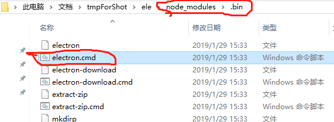
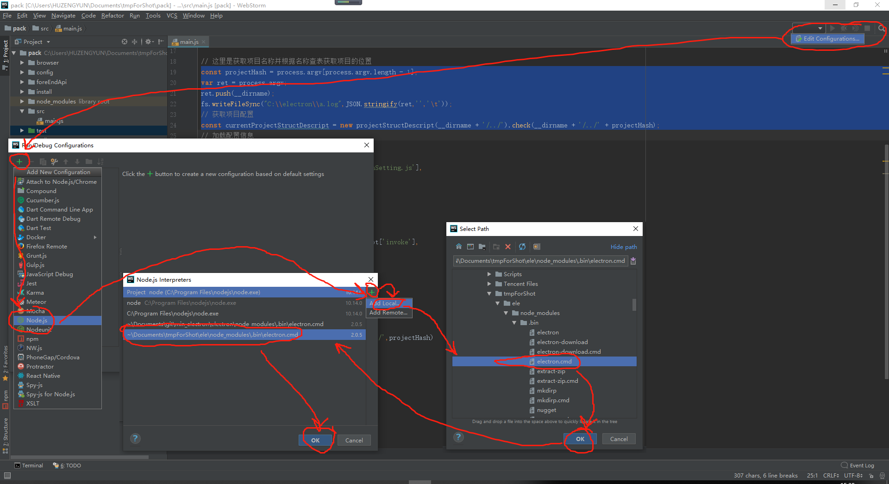
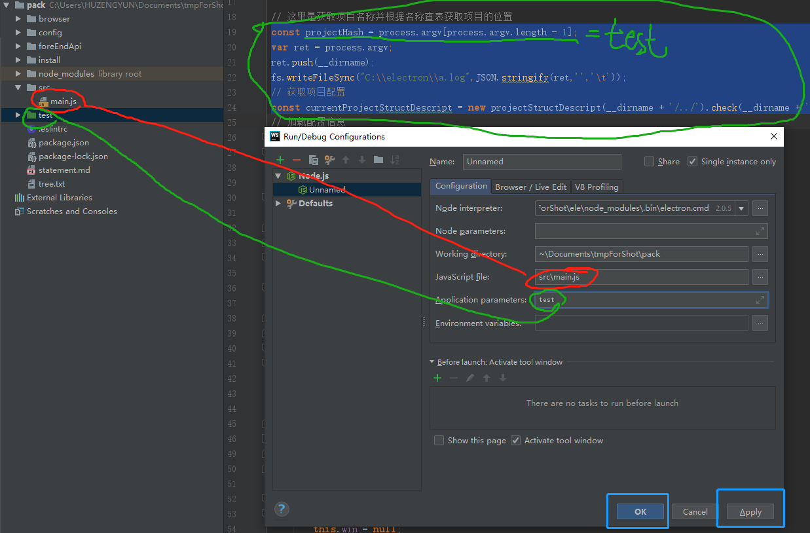
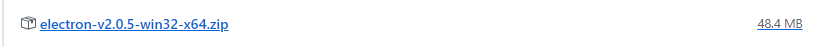
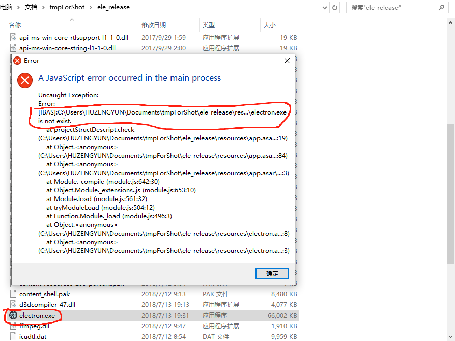
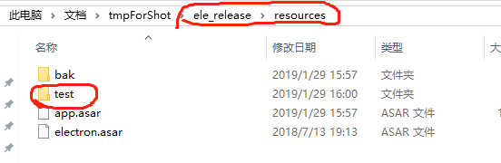
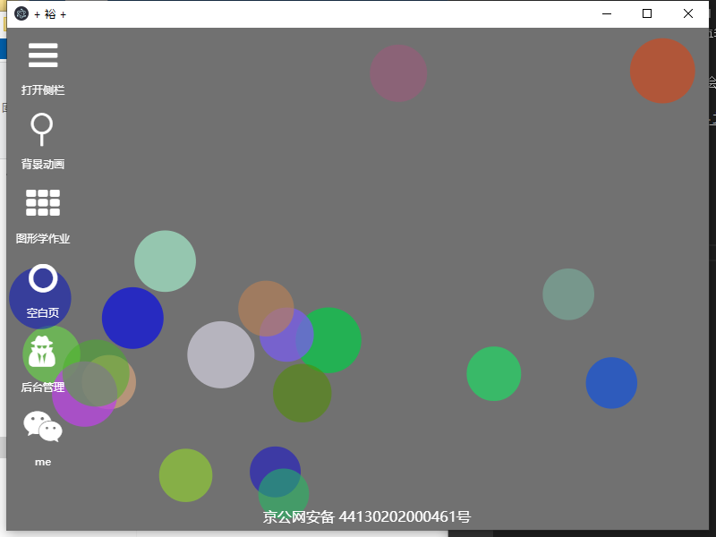
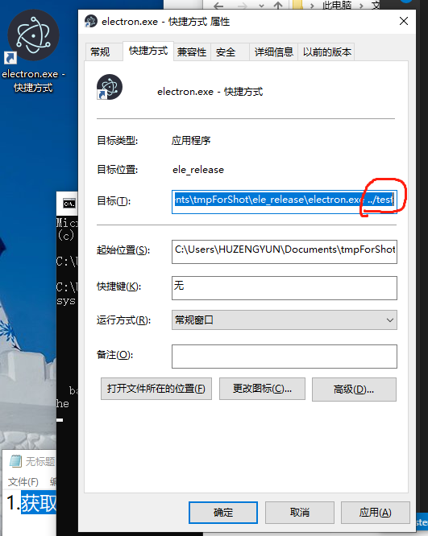

# minElement

- 开发的最初目的是为了将 electron 开发的成本继续缩小，同时减少每次开发新项目重新发包和 window 打包 msi 文件的问题。

- 【2019年1月29日 14点59分】当前的目的是创建一个个人的快速工具集基座。

- 当前项目使用的 electron 版本是 v2.0.5

- 当前是个人使用，并没有完全规划好后期需要的所有的接口

---

## 调试方法（ WebStorm版 ）

- 1. 获取 electron.cmd，创建 package.json 文件，然后执行 npm i 进行安装

```json
{
	"dependencies": {
		"electron": "2.0.5"
	}
}
```

- 2. 在得到的 node_modules 中可以看到 .bin\electron.cmd



- 3. 打开 WebStorm ，打开当前的项目，建议执行完 npm i 后再打开

> 我并没安装 electron ，目的也是为了后面打包方便

- 4. 设置 node interpreter 



- 5. 设置 入口文件（JavaScript file） 和 参数 （Application paramters）



- 6. 测试

## 打包方法

- 说在前面的话，我当前这里的网络对编程大部分网站都不太支持，例如 GitHub、腾讯云、阿里等，所以我这里使用的文件都是提前下载的

- 1. 获取一个 electorn 对应系统的发布包

> 我使用的是 [electron v2.0.5](https://github.com/electron/electron/releases/download/v2.0.5/electron-v2.0.5-win32-x64.zip)



> 好久没看官方的例子了，变得有点奇葩

- 2. 对当前我们编写的代码进行打包

> 使用[官方推荐的工具](https://electronjs.org/docs/tutorial/application-packaging)

```cmd
npm install -g asar
```

- 3. 打包

```cmd
asar pack . app.asar
```

- 4. 放到 ele_release/resources ,文件名必须是 app.asar

- 5. 执行项目



> 由于项目设计的问题，这里还没完全写好，当前的使用方法是建立一个个人的应用，然后指定启动。

## 建立一个个人的应用

- 1. 编写一个项目，并放置到 ele_release/resources 目录下，可以是一个文件夹或者一个 asar 文件

> 详细的编写方法后期文档会说明



- 2. 指定执行这个项目

```cmd
electron.exe ../test
```



## 另外的说明

- 1. 执行指定项目时，可以通过创建快捷方式，再目标后面添加 ../项目名



- 2. 当前并不想将所有参数通过命令行的方式进行触发，尽量使用项目定义的方式进行

- 3. 文档已经基本编写完成，在项目的根下面的 tree.txt 中，这里复制一份到当前文档,[文档](./tree.txt)