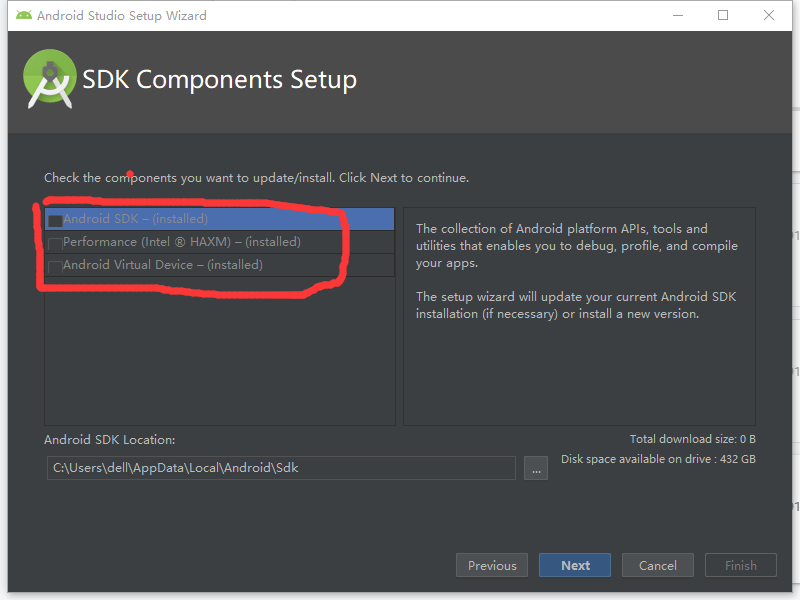

# flutter 周边环境安装

>> 我的电脑可以翻墙，所以有些地方如果有东西无法下载，我会下载的本地，另外如果有需要可以找我或者找国内资源

> 系统要求

> 1. [git](https://git-scm.com/)

> 64 位下载[链接](https://github.com/git-for-windows/git/releases/download/v2.20.1.windows.1/Git-2.20.1-64-bit.exe)

> 2 [Android SDK](https://dl.google.com/android/repository/sdk-tools-windows-4333796.zip) 这部分我只是走流程，真正做的是最后的方法靠谱，如果你也不需要安装 Android studio

> 

> - 其实 Android 官方说，Android Studio 里面包含了 SDKManager，但是实际上好像没有。。。，我这里只下载他的 SDKTool ，通过他我们下载自己需要的 sdk 。

> 官方原话

> 实际打开（什么都没有）

> - 曲线解法，先安装一个带 sdk 版本的 as2.3.3.0 然后更新,[下载地址](https://dl.google.com/dl/android/studio/install/2.3.3.0/android-studio-bundle-162.4069837-windows.exe)

---

> android sdk 使用另一种方法安装(针对windows用户)

> - 1. 安装 [jdk](https://www.oracle.com/technetwork/java/javase/downloads/jdk8-downloads-2133151.html)

> - 2. 安装 [android sdk r24.4.1](http://tools.android-studio.org/index.php/sdk)

>> 最终我安装的内容(记得无法翻墙请配置代理)

