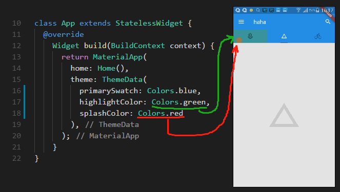
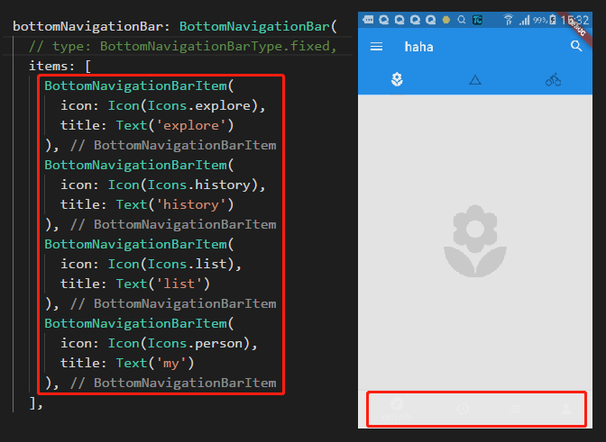

# 基础入门

## 问题

> 1. flutter 调试无效问题

>> 在使用下面的第一个例子时，发现无法进行热更新，我的猜测是 runApp 中直接编写代码，修改无法进行替换的问题。即 void main 在程序中为特定节点，更新时不进行替换，然后再将 runApp 中的内容修改指定函数时，指定函数修改可以被替换，因此可以进行热更新。

> 2. 数据问题(形如下面代码)

```log
Error: The argument type 'int/*1*/' can't be assigned to the parameter type
```

>> 没有找到为什么会发生以下错误，我通过删除 build 文件夹，重新跑项目将该问题解决，不清楚问题的本质是什么，可能是累积错误太多，导致误报。

> 3. 图片跨域和图片不存在问题

```log
(OS Error: No address associated with hostname, errno = 7)
```

>> 这类问题可能是定义了图片展示，但是无法看到效果，这类问题只要多看 log 就可以解决。

> 4. 发现非 main.dart 文件无法进行热部署

>> 编写修改 /lib/model/post.dart 文件时，发现文件修改不会通过热部署渲染在页面上。

---

> 1. 简单例子

```dart
import 'package:flutter/material.dart';

void main() {
    runApp(
        Center(
        child: Text(
          'hello',
          textDirection: TextDirection.ltr,
          style: TextStyle(
            fontSize: 40.0,
            fontWeight: FontWeight.bold,
            color: Colors.green
          )
        ),
      );
    );
}
```

> 2. 拆成部件进行编写

```dart
import 'package:flutter/material.dart';

void main() {
  runApp(
    Hello()
  );
}

class Hello extends StatelessWidget {
  @override
    Widget build(BuildContext context) {
      // TODO: implement build
      return Center(
        child: Text(
          'hello',
          textDirection: TextDirection.ltr,
          style: TextStyle(
            fontSize: 40.0,
            fontWeight: FontWeight.bold,
            color: Colors.green
          )
        ),
      );
    }
}
```


> 3. 更多内容

```dart
class App extends StatelessWidget {
  @override
    Widget build(BuildContext context) {
      // TODO: implement build
      return MaterialApp(
        home: Scaffold(
          appBar: AppBar(
            title: Text("NIHAO"),
            elevation: 0.0,
          ),
          body: Hello(),
        ),
        theme: ThemeData(
          primarySwatch: Colors.yellow
        ),
      );
    }
}

class Hello extends StatelessWidget {
  @override
    Widget build(BuildContext context) {
      // TODO: implement build
      return Center(
        child: Text(
          'hello',
          textDirection: TextDirection.ltr,
          style: TextStyle(
            fontSize: 40.0,
            fontWeight: FontWeight.bold,
            color: Colors.yellow
          )
        ),
      );
    }
}
```

> 4. 编写一个列表

- lib/main.dart

```dart
import 'package:flutter/material.dart';
import 'package:test_one/model/post.dart';

void main() {
  runApp(
    App()
  );
}

class App extends StatelessWidget {
  @override
    Widget build(BuildContext context) {
      return MaterialApp(
        home: Home(),
        theme: ThemeData(
          primarySwatch: Colors.blue
        ),
      );
    }
}

class Home extends StatelessWidget {
  Widget _listItemBuilder(BuildContext context,int index) {
    print('[index]:' + index.toString());
    var img = new Image.network(posts[index].imageUrl);

    return Container(
      color: Colors.white,
      margin: EdgeInsets.all(8.0),
      child: Column(
        children: <Widget>[
          img,
          SizedBox(height: 16.0),
          Text(
            posts[index].title,
            style: Theme.of(context).textTheme.title,
          ),
          Text(
            posts[index].author,
            style: Theme.of(context).textTheme.subhead,
          ),
          SizedBox(height: 16.0)
        ],
      ),
    );
  }

  @override
    Widget build(BuildContext context) {
      return Scaffold(
        backgroundColor: Colors.grey[100],
        appBar: AppBar(
          title: Text('haha'),
          elevation: 0.0,
        ),
        body: ListView.builder(
          itemCount: posts.length,
          itemBuilder: _listItemBuilder,
        ),
      );
    }
}
```

- lib/model/post.dart

```dart
class Post {
  const Post({
    this.title,
    this.author,
    this.imageUrl
  });

  final String title;
  final String author;
  final String imageUrl;
}

// 图片是直接复制 百度图片的图片的链接，可能会存在失效的问题
final List<Post> posts = [
  Post(
    title: 'Candy Shop',
    author: 'Mohamed Chahin',
    imageUrl: 'https://ss1.bdstatic.com/70cFuXSh_Q1YnxGkpoWK1HF6hhy/it/u=3735008710,1033072259&fm=27&gp=0.jpg',
  ),
  Post(
    title: 'Candy Shop',
    author: 'Mohamed Chahin',
    imageUrl: 'https://ss1.bdstatic.com/70cFvXSh_Q1YnxGkpoWK1HF6hhy/it/u=2088206210,2085020975&fm=27&gp=0.jpg',
  )
];
```


> 5. 主题设置

```dart
void main() {
  runApp(
    App()
  );
}

class App extends StatelessWidget {
  @override
    Widget build(BuildContext context) {
      // 返回一个主题配置
      return MaterialApp(
        home: Home(),
        // 主题设置
        theme: ThemeData(
          // 主要颜色
          primarySwatch: Colors.blue,
          // 高亮部分颜色
          highlightColor: Color.fromRGBO(255, 255, 255, 0.5),
          // 水波纹颜色
          splashColor: Colors.white70
        ),
      );
    }
}
```



> - 6. bottomNavigationBar 在按钮多于 3 个时会自动变成另一种类型



> 修改类型即可

```dart
bottomNavigationBar: BottomNavigationBar(
  // 添加这句话
  type: BottomNavigationBarType.fixed,
  items: [
    BottomNavigationBarItem(
      icon: Icon(Icons.explore),
      title: Text('explore')
    ),
    BottomNavigationBarItem(
      icon: Icon(Icons.history),
      title: Text('history')
    ),
    BottomNavigationBarItem(
      icon: Icon(Icons.list),
      title: Text('list')
    ),
    BottomNavigationBarItem(
      icon: Icon(Icons.person),
      title: Text('my')
    ),
  ],
),
```