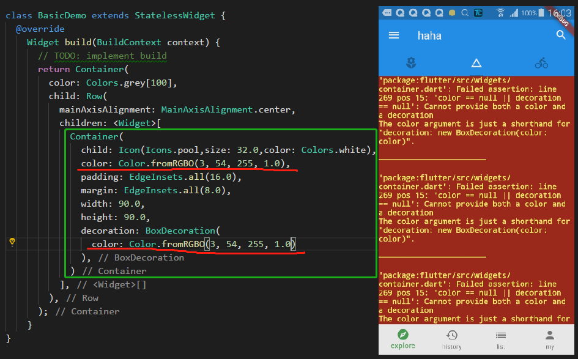

# 基础组件

> container (容器)

- 容器中多次设置颜色会报错



- 容器的边框

```dart
Container(
    child: Icon(Icons.pool,size: 32.0,color: Colors.white),
    // color: Color.fromRGBO(3, 54, 255, 1.0),
    padding: EdgeInsets.all(16.0),
    margin: EdgeInsets.all(8.0),
    width: 90.0,
    height: 90.0,
    decoration: BoxDecoration(
        color: Color.fromRGBO(3, 54, 255, 1.0),
        border: Border(
        top: BorderSide(
            color: Colors.indigoAccent[100],
            width: 3.0,
            style: BorderStyle.solid
        ),
        bottom: BorderSide(
            color: Colors.indigoAccent[100],
            width: 3.0,
            style: BorderStyle.solid
        ),
        left: BorderSide(
            color: Colors.indigoAccent[100],
            width: 3.0,
            style: BorderStyle.solid
        ),
        right: BorderSide(
            color: Colors.indigoAccent[100],
            width: 3.0,
            style: BorderStyle.solid
        ),
        )
    ),
)

// ====== 等同于下面

Container(
    child: Icon(Icons.pool,size: 32.0,color: Colors.white),
    // color: Color.fromRGBO(3, 54, 255, 1.0),
    padding: EdgeInsets.all(16.0),
    margin: EdgeInsets.all(8.0),
    width: 90.0,
    height: 90.0,
    decoration: BoxDecoration(
    color: Color.fromRGBO(3, 54, 255, 1.0),
    border: Border.all(
        color: Colors.indigoAccent[100],
        width: 3.0,
        style: BorderStyle.solid
    )
    ),
)
```

- 容器圆角(不能和容器的类型 circle 同时使用)


- 使用比例容器 AspectRatio

```dart
AspectRatio(
    aspectRatio: 1.0 / 1.0,
    child: Container(
    color: Color.fromRGBO(3, 54, 255, 1.0),
    ),
)
```


- 使用限定大小的容器

```dart
ConstrainedBox(
    constraints: BoxConstraints(
    minHeight: 200.0,
    maxWidth: 200.0
    ),
    child: Container(
    color: Colors.blueGrey,
    ),
)
```

> column & row

- column 是列排列 row 是行排列 

- mainAxisAlignment 主轴对齐方式，对于 column 是纵向的对齐方式

- crossAxisAlignment 交叉轴对齐方式，对于 column 是横向的对齐方式


