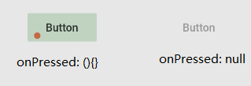
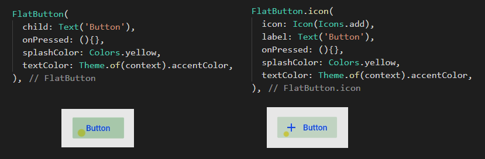
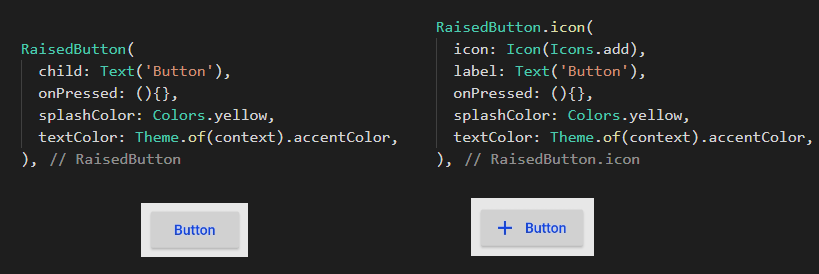
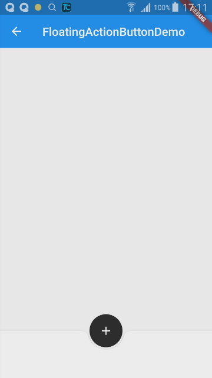

# 按钮

> - FlatButton 最基础的按钮

| 参数 | 说明 |
| -- | -- |
| splashColor | 水波纹的颜色 |

```dart
FlatButton(
    child: Text('Button'),
    onPressed: (){},
    splashColor: Colors.yellow,
)
```

- 当 onPressed 为 null 时，按钮会显示为灰色，当定义事件后，点击会有溅墨(水波纹)效果



> - FlatButton.icon 包装过的 FlatButton 图标

- FlatButton 中的 text 改为 text 并添加了 icon 属性



> - RaisedButton 带边框的样式按钮

> - 一个不错的例子



```dart
class FloatingActionButtonDemo extends StatelessWidget {
  final Widget _floatingActionButton = FloatingActionButton(
    onPressed: () {},
    child: Icon(Icons.add),
    elevation: 0.0,
    backgroundColor: Colors.black87,
    // shape: BeveledRectangleBorder(
    //   borderRadius: BorderRadius.circular(30.0)
    // ),
  );

  final Widget _floatingActionButtonExtended = FloatingActionButton.extended(
    onPressed: () {},
    icon: Icon(Icons.add),
    label: Text('Add'),
  );

  @override
  Widget build(BuildContext context) {
    return Scaffold(
      appBar: AppBar(
        title: Text("FloatingActionButtonDemo"),
        elevation: 0.0,
      ),
      floatingActionButton: _floatingActionButton,
      floatingActionButtonLocation: FloatingActionButtonLocation.centerDocked,
      bottomNavigationBar: BottomAppBar(
        child: Container(
          height: 80.0,
        ),
        shape: CircularNotchedRectangle(),
      ),
    );
  }
}
```

