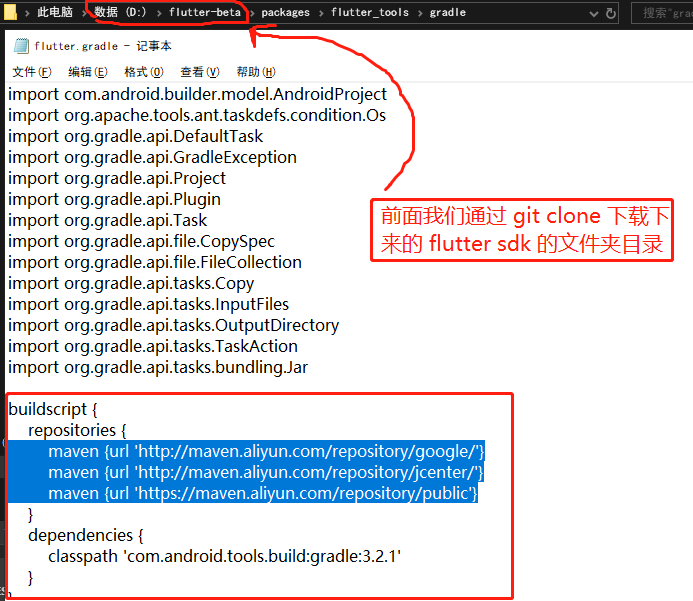
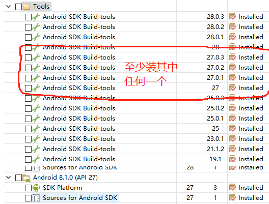
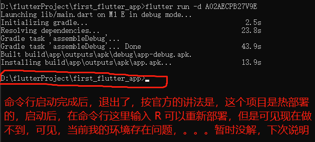

# 编写第一个 Flutter 应用

> 请将[上一个过程](https://github.com/IBAS0742/kaoyan/blob/master/兼顾内容/flutter学习%26开发/搭建环境说明.md)完成后再进入该文档

### 1. 利用 vscode 创建一个 flutter 应用

```text
启动 VS Code
调用 View>Command Palette…
输入 ‘flutter’, 然后选择 ‘Flutter: New Project’ action
输入 Project 名称 (如myapp), 然后按回车键
指定放置项目的位置，然后按蓝色的确定按钮
等待项目创建继续，并显示main.dart文件
```

>> 创建第一个 app 后 vscode 界面说明

>> 

>> 注意事项说明：

>> 1. 修改下载的源

```gradle
// android/build.gradle
buildscript {
    repositories {
        // 翻墙被拦截，因此我们把源修改一下
        // google()
        // jcenter()
        maven {url 'http://maven.aliyun.com/repository/google/'}
        maven {url 'http://maven.aliyun.com/repository/jcenter/'}
        maven {url 'http://maven.aliyun.com/repository/public/'}
    }

    dependencies {
        classpath 'com.android.tools.build:gradle:3.2.1'
    }
}

allprojects {
    repositories {
        // google()
        // jcenter()
        maven {url 'http://maven.aliyun.com/repository/google/'}
        maven {url 'http://maven.aliyun.com/repository/jcenter/'}
        maven {url 'http://maven.aliyun.com/repository/public/'}
    }
}
```

>> 这里需要补充的一个地方是，虽然眼见这里已经将源进行修改，但是，不知道为什么，flutter 还是要去 dl.google.com 下载，所以经过千辛万苦的百度，了解到，需要修改另一个文件



>> 可以运行了，使用 vscode 的是配置 launch.json 文件



>> 运行成功，下面总结问题

---

---

---

# 问题总结

> 1. 启动白屏

> 解决方案

```text
// 先让我们 GitHub 上看一下
```

> 2. 命令行启动后直接退出




