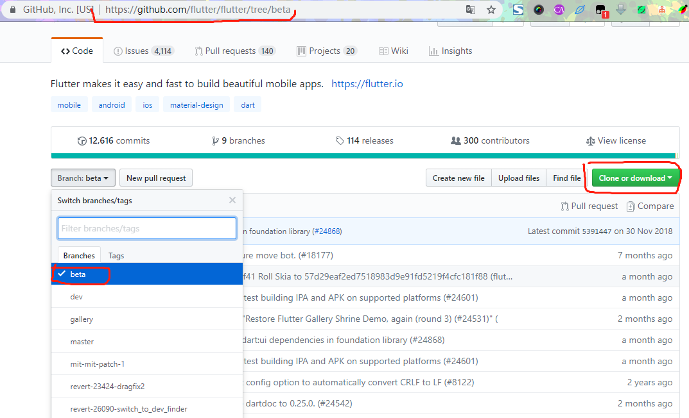
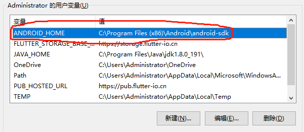
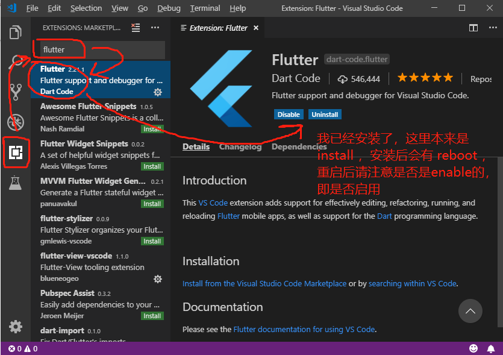

#  flutter 环境搭建

> [参考网页](https://flutterchina.club/get-started/install/)


## 1. 配置环境变量

```bash
# 文档的方法是 linux 下的方法
export PUB_HOSTED_URL=https://pub.flutter-io.cn
export FLUTTER_STORAGE_BASE_URL=https://storage.flutter-io.cn

# window 的对应方法是直接设置环境变量
```


# 2. 安装所需软件

> 1. [Git for window](https://git-scm.com/download/win) 翻墙问题自行解决

```JavaScript
var idm64 = 'https://github.com/git-for-windows/git/releases/download/v2.20.1.windows.1/Git-2.20.1-64-bit.exe';
var idm32 = 'https://github.com/git-for-windows/git/releases/download/v2.20.1.windows.1/Git-2.20.1-32-bit.exe';

var idm64_portable = 'https://github.com/git-for-windows/git/releases/download/v2.20.1.windows.1/PortableGit-2.20.1-64-bit.7z.exe';

var idm32_portable = 'https://github.com/git-for-windows/git/releases/download/v2.20.1.windows.1/PortableGit-2.20.1-32-bit.7z.exe'
```

# 3. 安装SDK（翻墙问题依旧）

> 我的flutter是安装 GitHub 对应的 beta 版本，可以直接下载然后解压



> 安装 flutter


> 配置到环境变量中


> flutter doctor


```bash
# 说明
# flutter 必须是[√]
# Android sdk 不能是 [×]
# AS VsCode IDEA （三个IDE）无所谓
# 连接设备无所谓

# 其中注意一点是，环境变量必须配置好 ANDROID_HOME
```



# 4. IDE 配置（我用的是 vscode）

> 1. [vscode 下载](https://code.visualstudio.com/Download)

> 2. 安装 flutter 插件



> 3. 重启后，可以在命令行运行 flutter doctor 看是否 vscode 可以使用

```bash
[√] VS Code (version 1.30.2)
```

# 安装基本环境基本就结束了，下面是开始编写例子了。后面的坑，我们下面继续


