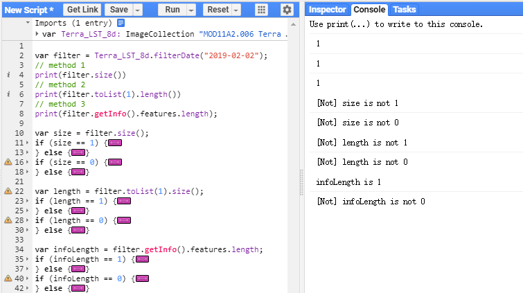

# get ImageCollection length

```javascript
// 随机拿一个卫星数据为例
var Terra_LST_8d = ee.ImageCollection("MODIS/006/MOD11A2");

var filter = Terra_LST_8d.filterDate("2019-02-02");
// method 1
print(filter.size())
// ==> 1

// method 2
print(filter.toList(1).length())
// ==> 1

// method 3
print(filter.getInfo().features.length);
// ==> 1

var size = filter.size();
if (size == 1) {
  print("size is 1");
} else {
  print("[Not] size is not 1");
}
if (size == 0) {
  print("size is 0");
} else {
  print("[Not] size is not 0");
}

var length = filter.toList(1).size();
if (length == 1) {
  print("length is 1");
} else {
  print("[Not] length is not 1");
}
if (length == 0) {
  print("length is 0");
} else {
  print("[Not] length is not 0");
}

var infoLength = filter.getInfo().features.length;
if (infoLength == 1) {
  print("infoLength is 1");
} else {
  print("[Not] infoLength is not 1");
}
if (infoLength == 0) {
  print("infoLength is 0");
} else {
  print("[Not] infoLength is not 0");
}
```

