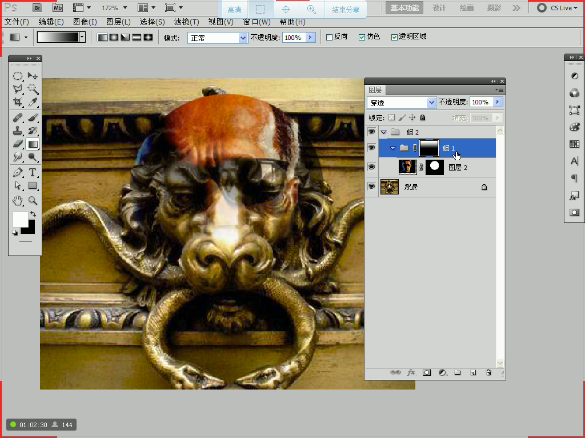

> 快捷键

| 快捷键 | 说明 |
| -- | -- |
| 空格 | 暂时切换到抓手 |
| TAB | 隐藏所有工具栏 |
| F | 切换显示模式 |
| Z | 放大镜 |
| CTRL + " | 打开网格 |
| CTRL + K | 打开首选项 |
| CTRL + R | 显示标线 |
| CTRL + TAB | 切换画布 |
| M | 选区 |
| SHIFT | 约束为正方、正圆、直线 |
| ALT | 以鼠标为中心进行绘制 |
| X | 切换前后背景色 |
| D | 恢复背景色默认颜色 |
| CTRL + ALT + Z | 历史回退 |
| CTRL + D | 取消选区 |
| CTRL + : | 取消辅助线 |
| C | 裁剪 |
| CTRL + SHIFT + ALT + N | 新建图层 |
| SHIFT + 工具快捷键 | 切换工具隐藏工具 |
| ALT + S + T | 变换选区 |
| F12 | 恢复到打开状态 |
| CTRL + J | 复制图层/选区内容到新图层 |
| L | 套索工具 |
| CTRL + [ | 下移图层 |
| CTRL + ] | 上移图层 |
| CTRL + SHIFT + [/] | 移动到最下/上层 |
| T | 文字 |
| ctrl + u | 色相/饱和度 |
| alt + shift + backspace | 填充前景色到非透明区域 |
| ctrl + shift + backspace | 填充背景色到非透明区域 |

区域填充
- CTRL + BACKSPACE 使用背景色
- ALT + BACKSPACE 使用前景色
- SHIFT 选区加法运算
- ALT 选区减法运算
- SHIFT + ALT 选区相交运算
- 按住 CTRL 再点击图层，图层会变成选区
- ctrl + shift + i 反选

套索
- BACKSPACE 可以删除前一个点
- 多边形套索过程中按住 ALT 可以暂时切换套索

图形
- CTRL + 回车 可以将图形变成选区

文字
- 输入完成按 CTRL + 回车
- 多行文本时， ALT + 上下键 调节行距，左右键 添加字边距

画笔和橡皮擦
- 中文输入法下，按住 【、】对口径进行缩小放大

绘制虚线
- 1.定义一个形状
- 2.选择定义的造型（CTRL+E+B）
- 3.F5修改画笔面板
- 4.形状动态改为：方向
- 5.属性调节

蒙版
- 白色内容显示、黑色内容隐藏
- shift + 鼠标左键单击  --> 暂时隐藏模板效果
- 直接鼠标左键单击  --> 显示模板效果
- alt + 鼠标左键单击  --> 只显示模板（重复取消操作）
- 【注】背景层是不能加蒙版的，可以双击背景层然后回车即可
- 当需要添加多个蒙版的时候，可以使用组（CTRL + G）

