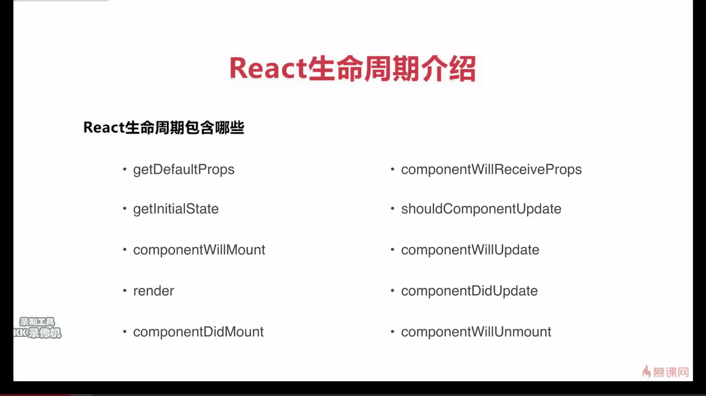
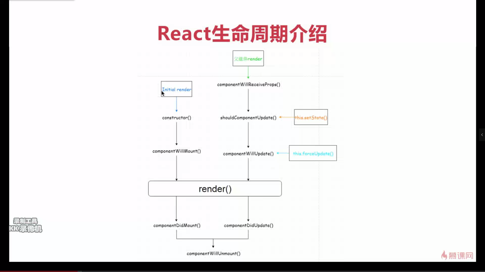

### react 入门学习

- react 课程内容


- react 生命周期函数



> render 是必有的

> componentWillMount 最为常用

- react 生命周期



### 开始编写 React 代码

```jsx
import { Component } from 'react';
import Child from './Child';

export default class Life extends Component {
    constructor(props) {
        super(props);
        this.state = {
            content:'ibas'
        };
    }

    changeAsBing = () => {
        this.setState({
            content: 'bing'
        });
    };

    changeAsIBAS() {
        this.setState({
            content: 'ibas'
        });
    }

    render() {
        return <div>
            <div>{this.state.content}</div>
            <button onClick={this.changeAsBing}>改成bing</button>
            <button onClick={this.changeAsIBAS.bind(this)}>改成IBAS</button>
            <Child name={this.state.content}></Child>
        </div>
    }
}

/// Child
import React,{ Component } from 'react'

export default class Child extends Component {
    constructor(props) {
        super(props);
    }

    render() {
        return <div>
            <div>{this.props.name}</div>
        </div>
    }
}

```

- 上面代码说明

> - improt React 虽然没有用到 React ，但是编译时需要，不然会报错

> - 定义点击事件时，需要使用 onClick，c 需要大写

> - 调用方法时使用 this.方法名 需要定义为 lamda 方法，如果是定义为类的方法，需要绑定到 this，this.方法名.bind(this)

> - 定义 react 组件时需要继承 Component

> - 定义组件变量时需要使用state，并使用 this.setState 进行改变变量的值

> - 给子组件传递数据时，只需要直接在组件上定义名字和值，子组件对改变量的任何赋值和定义均无效，且不报错

### 按需加载内容

```cmd
yarn add babel-plugin-import
```