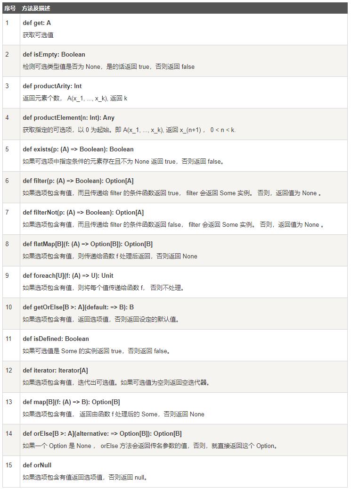

# scala 入门

- [参考教程](http://www.runoob.com/scala)

## 函数和方法

> ??? 这部分文档感觉有点奇怪，其实个人理解就是 ```scala``` 可以定义函数作为参数进行传递

```scala
def delayed( t: => Long ) = {
    println("在 delayed 方法内")
    println("参数： " + t)
    t
}
def time() = {
    println("获取时间，单位为纳秒")
    System.nanoTime
}

time
// 获取时间，单位为纳秒
// res6: Long = 337284462347800

delayed(time);
// 在 delayed 方法内
// 获取时间，单位为纳秒
// 参数： 337292810294500
// 获取时间，单位为纳秒
// res7: Long = 337292811354600
```

- 函数可变参

```scala
def printStrings( args:String* ) = {
    var i : Int = 0;
    for( arg <- args ){
        println("Arg value[" + i + "] = " + arg );
        i = i + 1;
    }
}
```

- 递归

```scala
def factorial(n: BigInt): BigInt = {  
    if (n <= 1)
        1  
    else    
        n * factorial(n - 1)
}
factorial(5);
// 120
```

- 默认参数

```scala
def factorial(n: BigInt = 5): BigInt = {  
    if (n <= 1)
        1  
    else    
        n * factorial(n - 1)
}
factorial()
// 120
```

- 将函数作为返回值

```scala
def retFn () : (Int => Int) = {
    def a(arg: Int): Int = {
        arg * 5
    }
    a
}

(retFn())(5)
// 25
retFn()(5)
// 25
```

- 匿名函数

```scala
((x:Int) => x + 1)(5)
// 6

((x: Int) => {
	x * x + x
})(5);

// 30
```

- 预定义参数

```scala
var logA = ((a:Int,b:Int) => {
	println(a + " <--a b--> " + b)
})(5,_: Int);

logA(15)
// 5 <--a b--> 15

var logB = ((a:Int,b:Int,c: Int) => {
	println(a + " <--a b--> " + b + "  c==> " + c)
})(5,_: Int,_: Int);

logB(12,15)
// 5 <--a b--> 12  c==> 15
```

- 函数柯里化

> 柯里化不能分布传递参数，需要一次性传递

```scala
def log(a: Int)(b: Int) = {
	println(a + " <--a b--> " + b)
}

log(23)(41);
// 23 <--a b--> 41

log(12);
// <console>:13: error: missing argument list for method log
// Unapplied methods are only converted to functions when a function type is expected.
// You can make this conversion explicit by writing `log _` or `log(_)(_)` instead of `log`.

var log = ((a: Int)(b: Int) => {
	println(a + " <--a b--> " + b)
})(12);
// <console>:1: error: not a legal formal parameter.
// Note: Tuples cannot be directly destructured in method or function parameters.
//      Either create a single parameter accepting the Tuple1,
//      or consider a pattern matching anonymous function: `{ case (param1, param1) => ... }
//       var log = ((a: Int)(b: Int) => {
```

## 字符串

| 方法 | 说明 |
| -- | -- |
| char charAt(int index) | 返回指定位置的字符 |
| int compareTo(Object o) | 比较字符串与对象 |
| int compareTo(String anotherString) | 按字典顺序比较两个字符串 |
| int compareToIgnoreCase(String str) | 按字典顺序比较两个字符串，不考虑大小写 |
| String concat(String str) | 将指定字符串连接到此字符串的结尾 |
| boolean contentEquals(StringBuffer sb) | 将此字符串与指定的 StringBuffer 比较。 |
| static String copyValueOf(char[] data) | 返回指定数组中表示该字符序列的 String |
| static String copyValueOf(char[] data, int offset, int count) | 返回指定数组中表示该字符序列的 String |
| boolean endsWith(String suffix) | 测试此字符串是否以指定的后缀结束 |
| boolean equals(Object anObject) | 将此字符串与指定的对象比较 |
| boolean equalsIgnoreCase(String anotherString) | 将此 String 与另一个 String 比较，不考虑大小写 |
| byte getBytes() | 使用平台的默认字符集将此 String 编码为 byte 序列，并将结果存储到一个新的 byte 数组中 |
| byte[] getBytes(String charsetName | 使用指定的字符集将此 String 编码为 byte 序列，并将结果存储到一个新的 byte 数组中 |
| void getChars(int srcBegin, int srcEnd, char[] dst, int dstBegin) | 将字符从此字符串复制到目标字符数组 |
| int hashCode() | 返回此字符串的哈希码 |
| int indexOf(int ch) | 返回指定字符在此字符串中第一次出现处的索引 |
| int indexOf(int ch, int fromIndex) | 返回在此字符串中第一次出现指定字符处的索引，从指定的索引开始搜索 |
| int indexOf(String str) | 返回指定子字符串在此字符串中第一次出现处的索引 |
| int indexOf(String str, int fromIndex) | 返回指定子字符串在此字符串中第一次出现处的索引，从指定的索引开始 |
| String intern() | 返回字符串对象的规范化表示形式 |
| int lastIndexOf(int ch) | 返回指定字符在此字符串中最后一次出现处的索引 |
| int lastIndexOf(int ch, int fromIndex) | 返回指定字符在此字符串中最后一次出现处的索引，从指定的索引处开始进行反向搜索 |
| int lastIndexOf(String str) | 返回指定子字符串在此字符串中最右边出现处的索引 |
| int lastIndexOf(String str, int fromIndex) | 返回指定子字符串在此字符串中最后一次出现处的索引，从指定的索引开始反向搜索 |
| int length() | 返回此字符串的长度 |
| boolean matches(String regex) | 告知此字符串是否匹配给定的正则表达式 |
| boolean regionMatches(boolean ignoreCase, int toffset, String other, int ooffset, int len) | 测试两个字符串区域是否相等 |
| boolean regionMatches(int toffset, String other, int ooffset, int len) | 测试两个字符串区域是否相等 |
| String replace(char oldChar, char newChar) | 返回一个新的字符串，它是通过用 newChar 替换此字符串中出现的所有 oldChar 得到的 |
| String replaceAll(String regex, String replacement | 使用给定的 replacement 替换此字符串所有匹配给定的正则表达式的子字符串 |
| String replaceFirst(String regex, String replacement) | 使用给定的 replacement 替换此字符串匹配给定的正则表达式的第一个子字符串 |
| String[] split(String regex) | 根据给定正则表达式的匹配拆分此字符串 |
| String[] split(String regex, int limit) | 根据匹配给定的正则表达式来拆分此字符串 |
| boolean startsWith(String prefix) | 测试此字符串是否以指定的前缀开始 |
| boolean startsWith(String prefix, int toffset) | 测试此字符串从指定索引开始的子字符串是否以指定前缀开始。 |
| CharSequence subSequence(int beginIndex, int endIndex) | 返回一个新的字符序列，它是此序列的一个子序列 |
| String substring(int beginIndex) | 返回一个新的字符串，它是此字符串的一个子字符串 |
| String substring(int beginIndex, int endIndex) | 返回一个新字符串，它是此字符串的一个子字符串 |
| char[] toCharArray() | 将此字符串转换为一个新的字符数组 |
| String toLowerCase() | 使用默认语言环境的规则将此 String 中的所有字符都转换为小写 |
| String toLowerCase(Locale locale) | 使用给定 Locale 的规则将此 String 中的所有字符都转换为小写 |
| String toString() | 返回此对象本身（它已经是一个字符串！） |
| String toUpperCase() | 使用默认语言环境的规则将此 String 中的所有字符都转换为大写 |
| String toUpperCase(Locale locale) | 使用给定 Locale 的规则将此 String 中的所有字符都转换为大写 |
| String trim() | 删除指定字符串的首尾空白符 |
| static String valueOf(primitive data type x) | 返回指定类型参数的字符串表示形式 |

## 数组

```scala
var z:Array[String] = new Array[String](3)
// 或
var z = new Array[String](3);
// 或
var z = Array("Runoob", "Baidu", "Google")

z(0) = "Runoob"; 
z(1) = "Baidu"; 
z(4/2) = "Google"
```


## 集合

> [List](http://www.runoob.com/scala/scala-lists.html)

```scala
List("Runoob", "Google", "Baidu")
// 或
1 :: (2 :: Nil)
```


> [Set](http://www.runoob.com/scala/scala-sets.html)

```scala
Set("Runoob", "Google", "Baidu")
```

> [Map](http://www.runoob.com/scala/scala-maps.html)

```scala
// 空哈希表，键为字符串，值为整型
var A:Map[Char,Int] = Map()
A += ('I' -> 1)
A += ('J' -> 5)
A += ('K' -> 10)
A += ('L' -> 100)

// Map 键值对演示
val colors = Map("red" -> "#FF0000", "azure" -> "#F0FFFF")
```

> [元组](http://www.runoob.com/scala/scala-tuples.html)

```scala
new Tuple3(1, 3.14, "Fred")
// 或
(1, 3.14, "Fred")

// 迭代
val t = (4,3,2,1) 
t.productIterator.foreach{ 
    i =>println("Value = " + i )
}

// 转字符串
">>" + (1,"fe").toString() + "<<"
// res28: String = >>(1,fe)<<

// 交换(只能是两个的时候可以使用该方法)
(1,"fe").swap
// res24: (String, Int) = (fe,1)
```

> [Option](http://www.runoob.com/scala/scala-options.html)

```scala
val myMap: Map[String, String] = Map("key1" -> "value")
var value1: Option[String] = myMap.get("key1")
// some("value")
var value2: Option[String] = myMap.get("key2")
// None

def show(x: Option[String]) = x match {
    case Some(s) => s
    case None => "?"
}
show(value1)
// value
```



> [Iterator](http://www.runoob.com/scala/scala-iterators.html)

```scala
Iterator("Baidu", "Google", "Runoob", "Taobao")
```


## 类

> 定义和使用

```scala
class Point(xc: Int, yc: Int) {
   var x: Int = xc
   var y: Int = yc

   def move(dx: Int, dy: Int) {
      x = x + dx
      y = y + dy
      println ("x 的坐标点: " + x);
      println ("y 的坐标点: " + y);
   }
}

new Point(1,2).move(1,2)
// x 的坐标点: 2
// y 的坐标点: 4
```

> 继承

> 重写方法不需要将变量定义为 override

> scala 只允许继承一个父类

```scala
class Point(xc: Int, yc: Int) {
   var x: Int = xc
   var y: Int = yc

   def move(dx: Int, dy: Int) {
      x = x + dx
      y = y + dy
      println ("x 的坐标点: " + x);
      println ("y 的坐标点: " + y);
   }
}

class Location(override val xc: Int, override val yc: Int,
   val zc :Int) extends Point(xc, yc) {
   var z: Int = zc

   def move(dx: Int, dy: Int, dz: Int) {
      x = x + dx
      y = y + dy
      z = z + dz
      println ("x 的坐标点 : " + x);
      println ("y 的坐标点 : " + y);
      println ("z 的坐标点 : " + z);
   }
}
```

> 伴生对象

```scala
import scala.language.reflectiveCalls
var m = (() => {
	// 私有构造方法
	class Marker private(val color:String) {

		println("创建前");
		println("创建" + this)
		println("创建后");

		override def toString(): String = "颜色标记："+ color

	}

	// 伴生对象，与类名字相同，可以访问类的私有属性和方法
	object Marker{
		private val markers: Map[String, Marker] = Map(
			"red" -> new Marker("red"),
			"blue" -> new Marker("blue"),
			"green" -> new Marker("green")
		)

		def apply(color:String) = {
			println(">>>apply<<<");
			if(markers.contains(color)) {
				markers(color);
			} else {
				null;
			}
		}

		def getMarker(color:String) = { 
			if(markers.contains(color)) markers(color) else null
		}
		
		def entry() { 
			println(Marker("red"))  
			// 单例函数调用，省略了.(点)符号  
			Marker getMarker "blue"
		}
	}
	Marker
})();
// 创建前
// 创建颜色标记：red
// 创建后
// 创建前
// 创建颜色标记：blue
// 创建后
// 创建前
// 创建颜色标记：green
// 创建后

m.entry();
// >>>apply<<<
// 颜色标记：red

println(m.getMarker("red"))
// 颜色标记：red

println(m getMarker "red")
// 颜色标记：red

m apply "red"
// >>>apply<<<
// res9: AnyRef{val color: String} = 颜色标记：red

scala> println(m apply "red")
// >>>apply<<<
// 颜色标记：red
```

> Trail 理解为接口

- scala不支持对类进行多继承，但是支持多重继承trait，使用with关键字即可 

```scala
trait Equal {
	val x:Int;
	def print() = {
		println(x);
	};
}

class AA extends {
	val x:Int = 12
} with Equal;

(new AA).print
//12
```

```scala
trait A {
	val x:Int;
	def printA() = {
		println("A" + x.toString());
	}
}

trait B {
	val x:Int;
	def printB() = {
		println("B" + x.toString());
	}
}

class AB extends {
	val x:Int = 10
} with A with B {
	def printAB() = {
		println("AB >>> " + x.toString())
	}
};

(new AB).printA
(new AB).printB
(new AB).printAB
```

## [正则表达式](http://www.runoob.com/scala/scala-regular-expressions.html)

```scala
import scala.util.matching.Regex
val pattern = new Regex("ibas")
val str = "ibas bing ibas haha"
(pattern findAllIn str).mkString(",")
```

## [异常处理](http://www.runoob.com/scala/scala-exception-handling.html)

## 提取器

- apply 构造时调用

- unapply 利用case反向获取内容时调用

```scala
object Test {
   def main(args: Array[String]) {
      
      val x = Test(5)
      println(x)

      x match
      {
          // 这里要获取 num 为何时，Test(num) = x
         case Test(num) => println(x + " 是 " + num + " 的两倍！")
         //unapply 被调用
         case _ => println("无法计算")
      }

   }
   def apply(x: Int) = x*2
   def unapply(z: Int): Option[Int] = if (z%2==0) Some(z/2) else None
}
```

## IO

> 从屏幕输入

```scala
import scala.io._
object Test {
   def main(args: Array[String]) {
      print("请输入菜鸟教程官网 : " )
      val line = StdIn.readLine()

      println("谢谢，你输入的是: " + line)
   }
}
```

> 从文件读取

```scala
import scala.io.Source

object Test {
   def main(args: Array[String]) {
      println("文件内容为:" )

      Source.fromFile("test.txt" ).foreach{ 
         print 
      }
   }
}
```

> 写入到文件

```scala
import java.io._

object Test {
   def main(args: Array[String]) {
      val writer = new PrintWriter(new File("test.txt" ))

      writer.write("菜鸟教程")
      writer.close()
   }
}
```
