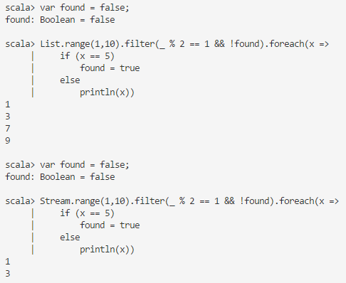

# 29.yield

- 关于 for

```scala
// 情景一
for(x <- c1; y <- c2; z <-c3) {...}
// 等效操作
c1.foreach(x => c2.foreach(y => c3.foreach(z => {...})))

// 实例
var c1 = Array(1,2,3);
var c2 = Array(4,5);
var c3 = Array(6);
for(x <- c1; y <- c2; z <-c3) {
    println(x + y + z);
}
// 11 = 1 + 4 + 6
// 12 = 1 + 5 + 6
// 12 = 2 + 4 + 6
// 13 = 2 + 5 + 6
// 13 = 3 + 4 + 6
// 14 = 3 + 5 + 6
// 等效
c1.foreach(x => c2.foreach(y => c3.foreach(z => {
    println(x + y + z);
})))
```

```scala
// 情景二
for(x <- c1; y <- c2; z <- c3) yield {...}
// 等效
c1.flatMap(x => c2.flatMap(y => c3.map(z => {...})))

var c2 = Array(4,5);
var c3 = Array(6);
var c4 = for(x <- c2; y <- c3) yield {
    println(x + y);
    x + y
}
// 10 = 4 + 6
// 11 = 5 + 6
// 等效
var c4 = c2.flatMap(x => c3.map(y => {
    println(x + y);
    x + y
}));
```

```scala
// 情景三
for(x <- c; if cond) yield {...}
// 等效
c.withFilter(x => cond).map(x => {...})
// 或
c.filter(x => cond).map(x => {...})
```

```scala
// 情景四
for(x <- c; y = ...) yield {...}
// 等效
c.map(x => (x, ...)).map((x,y) => {...})

var c1 = Array(1,2,3);
for (x <- c1;y = x + 1) {
    println(x * y);
}
//  2 = 1 * 2
//  6 = 2 * 3
// 12 = 3 * 4
```

- ```filter``` 和 ```withFilter``` 的区别

- ```Scala 2.7``` with List (strict) and Stream (non-strict):



```scala
var found = false;
List.range(1,10).filter(_ % 2 == 1 && !found).foreach(x => 
    if (x == 5)
        found = true 
    else
        println(x))

var found = false;
Stream.range(1,10).filter(_ % 2 == 1 && !found).foreach(x => 
    if (x == 5) 
        found = true 
    else 
        println(x))
```

- 如果使用 withFilter 

```scala
var found = false;
List.range(1,10).withFilter(_ % 2 == 1 && !found).foreach(x => 
    if (x == 5)
        found = true 
    else
        println(x))
// 1
// 3
```