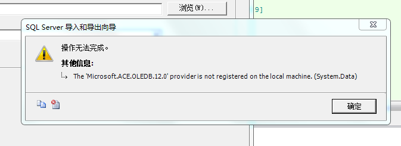
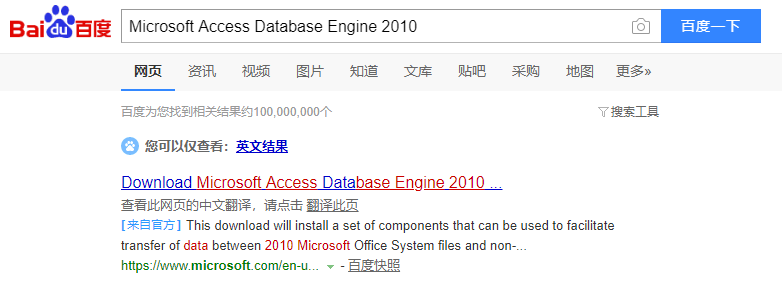
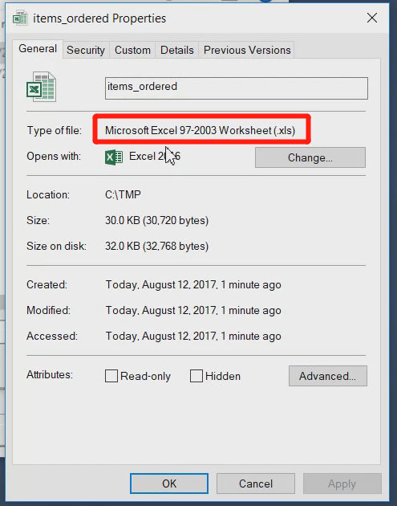

## Sql Server 导入数据库错误



> 解决方法

- 1. 安装对应版本的 ```Microsoft Access Database Engine```

[Microsoft Access Database Engine 2010](https://www.microsoft.com/en-us/download/details.aspx?id=13255)



- 2. 注意导入的 Excel 格式

```具体什么格式可以使用，我不知道，但是YouTube视频中有强调该格式```

```YouTube视频(导入 excel 文件失败解决)```[[SOLVED] SQL Server : The 'Microsoft.ACE.OLEDB.12.0' provider is not registered on the local machine](https://www.youtube.com/watch?v=QG9Yq-dPdcY)
```具体什么格式可以使用，我不知道，但是YouTube视频中有强调该格式```

```YouTube视频(导入 access 文件失败解决)```[Microsoft.ACE.OLEDB.12.0 provider is not registered on the local machine solution | FoxLearn](https://www.youtube.com/watch?v=lfRIsr7JKPE)





