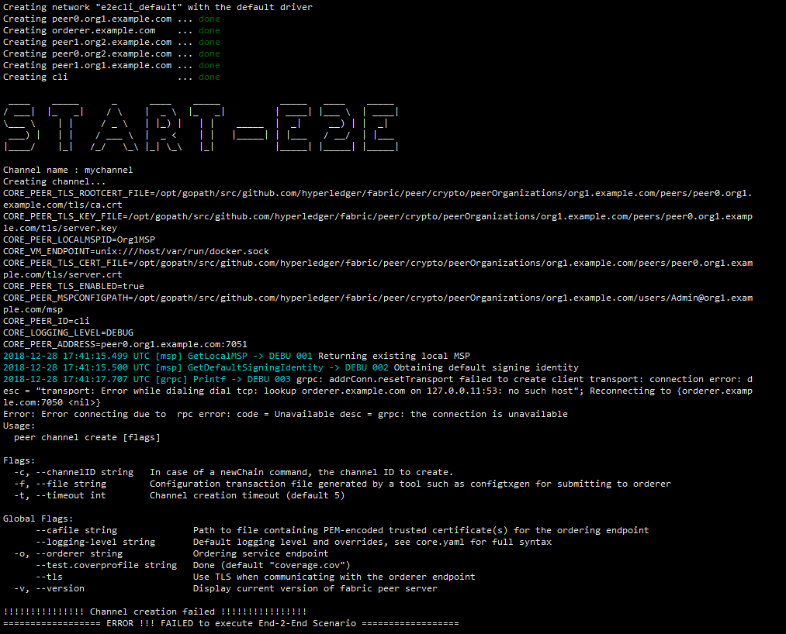

### 第一个问题

#### 重现

```bash
2018-12-28 17:41:15.499 UTC [msp] GetLocalMSP -> DEBU 001 Returning existing local MSP
2018-12-28 17:41:15.500 UTC [msp] GetDefaultSigningIdentity -> DEBU 002 Obtaining default signing identity
2018-12-28 17:41:17.707 UTC [grpc] Printf -> DEBU 003 grpc: addrConn.resetTransport failed to create client transport: connection error: esc = "transport: Error while dialing dial tcp: lookup orderer.example.com on 127.0.0.11:53: no such host"; Reconnecting to {orderer.examle.com:7050 <nil>}
Error: Error connecting due to  rpc error: code = Unavailable desc = grpc: the connection is unavailable
Usage:
  peer channel create [flags]

Flags:
  -c, --channelID string   In case of a newChain command, the channel ID to create.
  -f, --file string        Configuration transaction file generated by a tool such as configtxgen for submitting to orderer
  -t, --timeout int        Channel creation timeout (default 5)

Global Flags:
      --cafile string              Path to file containing PEM-encoded trusted certificate(s) for the ordering endpoint
      --logging-level string       Default logging level and overrides, see core.yaml for full syntax
  -o, --orderer string             Ordering service endpoint
      --test.coverprofile string   Done (default "coverage.cov")
      --tls                        Use TLS when communicating with the orderer endpoint
  -v, --version                    Display current version of fabric peer server

!!!!!!!!!!!!!!! Channel creation failed !!!!!!!!!!!!!!!!
================== ERROR !!! FAILED to execute End-2-End Scenario ==================
```



#### 解决方案

> https://juejin.im/entry/5b7ba10e6fb9a01a12502314

