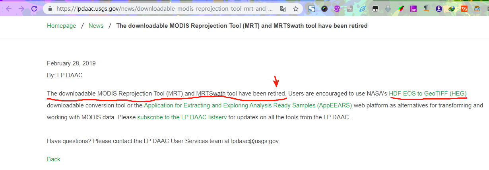
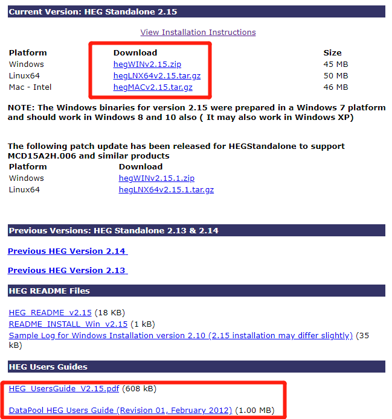

# 关于 modis 遥感影像重投影

> 一些文档会说使用[官方工具](https://lpdaac.usgs.gov/lpdaac/tools/modis_reprojection_tool)，但是官方工具已经退役


> 通过 Google 重新找到一个[网站](https://lpdaac.usgs.gov/news/downloadable-modis-reprojection-tool-mrt-and-mrtswath-tool-have-been-retired/)，官方给出说明，并推荐使用 [NASA 的工具](https://newsroom.gsfc.nasa.gov/sdptoolkit/HEG/HEGHome.html?_ga=2.55042859.1202840432.1563158659-1415489196.1556534620)



- 为了读者阅读时文件又被下架，这里保持了一个版本

- [Windows hegWINv2.15.zip 45 MB](https://jxjjxy-my.sharepoint.com/:u:/g/personal/1jtbiljrw_t_odmail_cn/Ea_uke7iIhZHtawNJkbUKpoBWkrYMvNZeF7aAcBPJvmBbw?e=Y9MFLS)

- [Linux64 hegLNX64v2.15.tar.gz 50 MB](https://jxjjxy-my.sharepoint.com/:u:/g/personal/1jtbiljrw_t_odmail_cn/ERFYNQ49E1JNoslclnRKaysBQ9f-WB4gjtRv9ZRgKcYfng?e=KQJLcX)

- [Mac-Intel hegMACv2.15.tar.gz	46 MB](https://jxjjxy-my.sharepoint.com/:u:/g/personal/1jtbiljrw_t_odmail_cn/EUAwVet7tL1EpkCfFv42okgBnJ8WNHmmJym6MCck5Y6t5Q?e=c8Oinw)

- [HEG_UsersGuide_V2.15.pdf (608 kB)](https://jxjjxy-my.sharepoint.com/:b:/g/personal/1jtbiljrw_t_odmail_cn/EcsaaOfXYh1FuJb9LIcvFuYB3fnxVnfs_oxQHtkXLfgNkg?e=ajoVYk)

- [DataPool HEG Users Guide (Revision 01, February 2012) (1.00 MB)](https://jxjjxy-my.sharepoint.com/:b:/g/personal/1jtbiljrw_t_odmail_cn/ESsw6BXIGIZEtFYADfELUsYBkY62FnStUwvTxY3R-3kZ-Q?e=t2ZCq8)



> 以下是官方的安装说明

```
INSTALLATION INSTRUCTIONS FOR THE HEG SOFTWARE:

Installation on Win 7, 8, and 10

Install java (jre8 or newer windows version).
In this directory, where this README file is located, locate install.bat file.
Double click on install.bat and follow the instruction in MS-DOS window that appears.
A file HEGTool.bat will be created by the installation. Copy that file into <the subdirectory where heg is installed>\HEG_Win\bin. Please note that windows NT users may have a problem creating HEGTool.bat file. They need to go to ....\HEG_Win\bin directory and modify the existing HEGTool.bat, modifying paths as noted below.
Go to the bin directory, where HEGTool.bat was copied to, and write click on HEGTool.bat. Click on the Properties and then click on the Program tab. Click on the Change Icon, then click on Browse.. and select the file "heg.ico" in this bin directory, then click Open. Click OK on "Change Icon" window. On "Properties" window there are two spaces for "Cmd line:" and "Working:". Make sure that first one indicates HEGTool.bat in current directory and second one is full path of the current bin directory. After this click Apply, then click OK.
Once this is done a "shortcut to HEGTool.bat" or "Heg" (which is actually a shortcut to HEGTool.bat) will be created. If this did not happen automatically, right click on HEGTool.bat, and click on Create Shortcut.
Using this new shortcut you can create a new shortcut to put in any other directory (such as Desktop).
To run HEG Double click on any of the created shortcuts or HEGTool.bat itself.

Installation for SUN, MAC, and LINUX
There are two ways to install HEG on your system:

Run the install script
Manually install HEG
IMPORTANT: Before installing HEG, make sure you have Java 1.8 or greater installed on your system.

1. RUNNING THE INSTALL SCRIPT
------------------------------
* Uncompress and extract the files contained in the tar file.

gunzip hegLNX64v2.15.tar.gz
tar -xvf hegLNX64v2.15.tar
   OR
gunzip hegMACv2.15.tar.gz
tar -xvf hegMACv2.15.tar

NOTE: Once the install script runs, it will automatically removes heg.tar from your current directory. If you want to backup this file, now is the time to do so. 

* Run the install script
./install

NOTE: The install script will ask you a series of questions to assist you in installing HEG on your system

* Once HEG is installed, go to the directory in which you installed HEG, go to the bin directory, and invoke the HEG script to load up the HEG GUI.

For example, if HEG is installed in /home/bob/heg,

cd /home/bob/heg/bin
./HEG

* ENJOY!

2. MANUALLY INSTALL HEG
------------------------
Make a heg directory in your home directory:

   cd $HOME
   mkdir heg

Change to the heg directory and copy the tar file to that location.

   cd heg
   mv (location of tar file/heg.tar.gz)

Uncompress and extract the file contained in the tar file.

   gunzip hegLNX64v2.15.tar.gz
   tar -xvf hegLNX64v2.15.tar
     OR
   gunzip hegMACv2.15.tar.gz
   tar -xvf hegMACv2.15.tar

After you uncompress and untar the file there will be two files, heg.tar and install. Ignore the install file. Untar the heg.tar file.

   tar-xvf heg.tar

change to the bin directory

   cd bin
   HEG

HEG has been installed and should be running.

NOTE: If you are having problems starting HEG (when typing HEG on the command line, then check that the directory path to JAVA on the local machine is correct. Also, check that the paths in the environment variables are correct.
```


