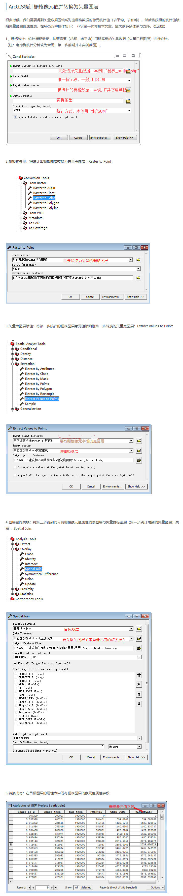

# ArcGIS统计栅格像元值并转换为矢量图层

> arcgis 做法



> matlab 做法

[围观我在哔哩哔哩的展示](https://www.bilibili.com/video/av69173072/)

[引子](https://ww2.mathworks.cn/matlabcentral/answers/440861-extract-data-from-a-matrix-for-each-polygon-in-a-shape-file)

```matlab
% shp 文件
shpName = 'test/myTest.shp';
% 要填写的字段 （就是刚刚的 test = 102）
shpField = 'test';
% 要分类的 栅格 文件
name = 'test/myTest_Clip.tif';
% 一个临时文件，我们可以看一下效果
tmpTifName = 'test/myTest_Clip.tmp.tif';
% 读取 shp 文件
S=shaperead(shpName);
[img,R] = geotiffread(name);
% 选择 90°，是更容易理解
img = rot90(img,3);
[img_x,img_y] = size(img);
x = R.LongitudeLimits(1);
dx = R.CellExtentInLongitude;
y = R.LatitudeLimits(1);
dy = R.CellExtentInLatitude;
outImg = uint32(zeros(img_x,img_y));
% 遍历并为每个 polygon 赋值
for ii = 1:numel(S)
  b = S(ii).BoundingBox;
  b(:,1) = (b(:,1) - x) / dx;
  b(:,2) = (b(:,2) - y) / dy;
  b = uint16(b);
  b(1,:) = b(1,:) - 1;
  b(1,:) = max(b(1,:),1);
  b(2,1) = min(b(2,1),img_x);
  b(2,2) = min(b(2,2),img_y);
  b = double(b);
  tmp = [];
  count = 1;
  xys = [];
  for xx = b(1,1) : b(2,1)
      for yy = b(1,2) : b(2,2)
          isin = inpolygon(xx * dx + x,yy * dy + y,S(ii).X,S(ii).Y);
          if (isin)
              c_x = xx;
              %c_x = xx;
              xys(:,count) = [c_x,yy];
              tmp(count) = img(c_x,yy);
              count = count + 1;
              outImg(c_x,yy) = ii;
          end
      end
  end
  S(ii).(shpField) = mode(tmp); % add your data here
end
geotiffwrite(tmpTifName,rot90(outImg,1),R);
shapewrite(S,shpName);
```