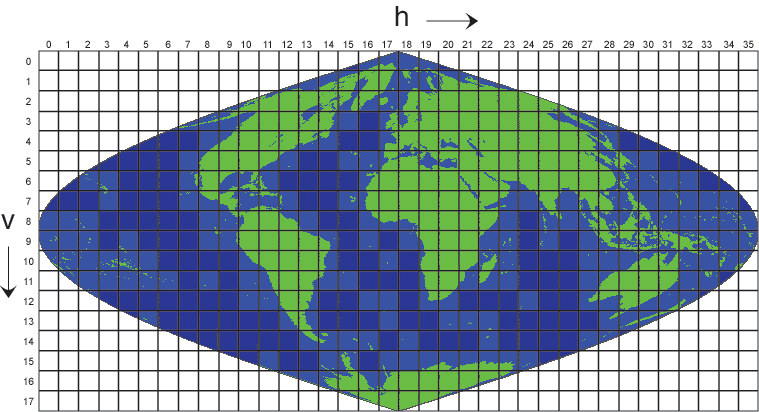

# modis 数据

> 1.切片图示



### 1.  MOD是Terra星数据----上午星；MYD是Aqua星数据----下午星。

### 2.  Terra卫星原始数据命名规则 >>>15位 A20040707140331.down

```
A定义为Terra卫星； YYYY-MM-DD-HH-MM-SS(年-月-日-时-分-秒)

20040707表示数据采集日期为2004年7月7日；140331表示该轨数据是在国际标准时间14时03分31秒入境的。

TERRA-MODIS 数据白天是下行数据，晚间是上行数据。即数据顺序白天由北向南获取，晚间数据由南向北顺序获取。 

Aqua卫星原始数据命名规则  >>>15位  B20040707181437.down   

B定义为Aqua卫星； YYYY-MM-DD-HH-MM-SS(年-月-日-时-分-秒)

 AQUA-MODIS数据白天是上行数据晚间是下行数据。即数据顺序白天由南向北获取，晚间数据由北向南顺序获取。
```

### 3. 0级数据文件名定义规则 >>>36位

```
P0420064AAAAAAAAAAAAAA04258094519001.PDS

P >>> PDS文件；

0420064 >>> 第一识别代码;AAAAAAA >>> 第二识别代码；AAAAAAA>>> 第三识别代码；

04-258-09-45-19 >>> 文件生成时间，格林尼治标准时间；2004年的第258天上午9时45分19秒

0-01 >>> 0表示数字识别码；01（Aqua）表示唯一文件号码；00（Terra）表示唯一文件号码。
```

### 4.  L1A 数据命名规则 >>> 20位

```
AMOD0120040707140331.hdf  

A表示上午星TERRA；B表示下午星AQUA；MOD表示传感器为MODIS；   01表示L1A数据；

2004-07-07表示数据采集日期为2004年7月7日；14-03-31表示该轨数据是在国际标准时间14时03分31秒入境的。 
```

### 5.  L1B 数据命名规则 >>> 23位

```
AMOD021KM20040707140331.hdf

A表示上午星TERRA；B表示下午星AQUA； 

MOD表示传感器为MODIS；   01表示L1A数据； 1KM表示1公里分辨率；

 2004-07-07表示数据采集日期为2004年7月7日；14-03-31表示该轨数据是在国际标准时间14时03分31秒入境的。 
```

### 6. 快视图像数据命名规则 >>> 15位

```
A20040707140331.jpg

 A表示上午星TERRA；B表示下午星AQUA； 

 2004-07-07表示数据采集日期为2004年7月7日；14-03-31表示该轨数据是在国际标准时间14时03分31秒入境的。 
```

### 7.  合成产品命名规则

```
MOD09A1.A2017025.h26v05.006.2017034123845.hdf

产品缩写 . 数据获取时间（YYY-DDD）. MODIS产品数据组成方式（水平XX-垂直YY）. 数据集版本号 . 产品生产时间（YYYY-DDD-HH-MM-SS）

行列>>>  2400*2400

MOD09A1产品的影像组成>>>

surface_reflectance_for_ban_1   >> 波段 620-670nm  >>  0.0001

surface_reflectance_for_ban_2   >> 波段 841-876nm  >>  0.0001

surface_reflectance_for_ban_3   >> 波段 459-479nm  >>  0.0001

surface_reflectance_for_ban_4   >> 波段 545-565nm  >>  0.0001

surface_reflectance_for_ban_5   >> 波段 1230-1250nm  >>  0.0001

surface_reflectance_for_ban_6   >> 波段 1628-1652nm  >>  0.0001

surface_reflectance_for_ban_7   >> 波段 2105-2155nm  >>  0.0001

surface_reflectance_500m_quality_control_flags  >>  na

solar_zenith  >>  0.01

view_zenith  >>  0.01

relative_azimuth  >>  0.01 

surface_reflectance_500m_state_flags>>  na

surface_reflectance_day_of_year>>  na
```