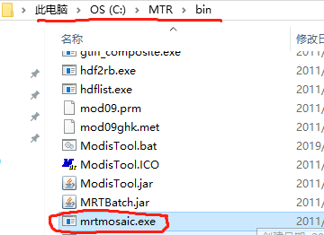

# mrtmosaic.exe



- [官方文档 第36页](https://jxjjxy-my.sharepoint.com/personal/1jtbiljrw_t_odmail_cn/Documents/mrt41_usermanual_032811.pdf)

- 简述官方文档中的使用说明

| 命令 | 说明 |
| -- | -- |
| i | 输入文件名文件(文件中是要合并的文件名的全路径) |
| o | 输出文件的文件名，必须和输入文件的格式相同 |
| g | 指定日志文件 |
| s | 如果使用该选项，需要指定一个 0 1 字符串，表示那个波段选中与否 |
| t | 将输入切片的位置信息保持到 tile.txt 中，输入文件必须包含 _h##v## 部分 |
| h | 将会把和成的投标信息保存到 TmpHdr.hdr 中 |

```
要合并的文件名的全路径，文件内容可以如下，输出文件的文件名格式必须是 hdf
C:\mod11a2.2019.jan\MOD11A2.A2019001.h00v08.006.2019010204024.hdf
C:\mod11a2.2019.jan\MOD11A2.A2019001.h00v09.006.2019010203539.hdf
C:\mod11a2.2019.jan\MOD11A2.A2019001.h00v10.006.2019010203224.hdf
C:\mod11a2.2019.jan\MOD11A2.A2019001.h01v07.006.2019010204251.hdf
C:\mod11a2.2019.jan\MOD11A2.A2019001.h01v08.006.2019010204437.hdf
```

- 命令行打印的说明

```
Usage: mrtmosaic -i input_filenames_file -t -h -o output_filename
                 -s spectral_subset "b1 b2 ... bN"
                 -g filename for the log file
   where input_filenames_file is a text file which contains the
   names of the files to be mosaicked.
   If using the -s switch, the SDSs should be represented as an
   array of 0s and 1s. A '1' specifies to process that SDS;
   '0' specifies to skip that SDS. Unspecified SDSs will not be processed.
   If the -s switch is not specified, then all SDSs will be processed.
   If -t is specified then the tile locations of the input
   filenames are output to tile.txt (-o, -s, and -h are not needed).
   Raw binary files must specify the tile locations in the filename
   to be used with the -t switch (i.e mod09ghk_h02v16.hdr).
   If -h is specified then the mosaicked header information will
   be output to TmpHdr.hdr (-o, -s, and -t are not needed).
   NOTE: Only input Sinusoidal and Integerized Sinusoidal
   projections are supported for mosaicking.

Example: mrtmosaic -i TmpMosaic.prm -s "1 1 0 1" -o mosaic.hdf
   This will mosaic the first, second, and fourth SDSs in each of
   the specified HDF files in TmpMosaic.prm.

Warning: mosaic : General Processing
     : Error processing the arguments for the mosaic tool
```