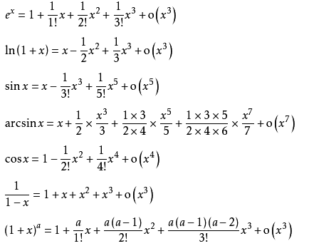
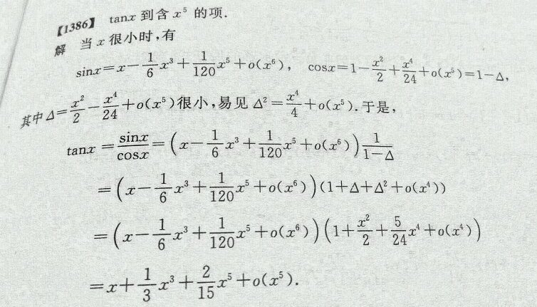
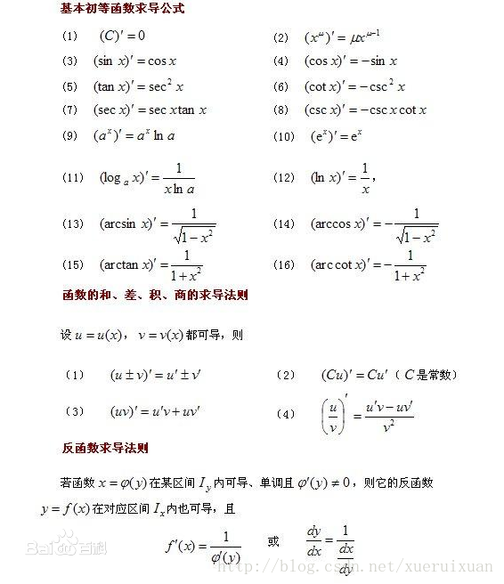
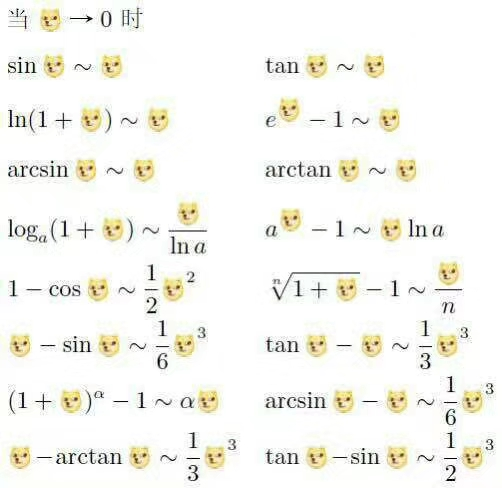
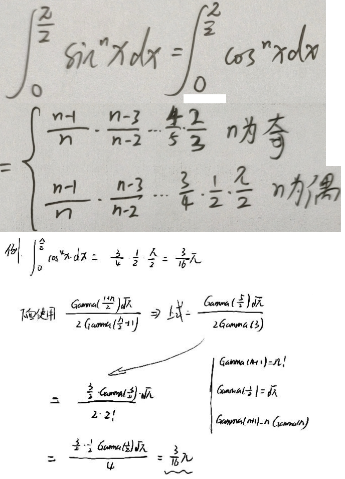

# 极限部分
### 泰勒展开式
#### 泰勒公式

#### 常用泰勒展开式




****

* 常见求导公式



****

* 极限公式



* 积分区域对称


* sin^n 积分公式

```
∫(0,π/2)[cos(x)]^ndx=∫(0,π/2)[sin(x)]^ndx
=(n-1)/n*(n-3)/(n-2)*…*4/5*2/3,n为奇数;
=(n-1)/n*(n-3)/(n-2)*…*3/4*1/2*π/2,n为偶数
```


